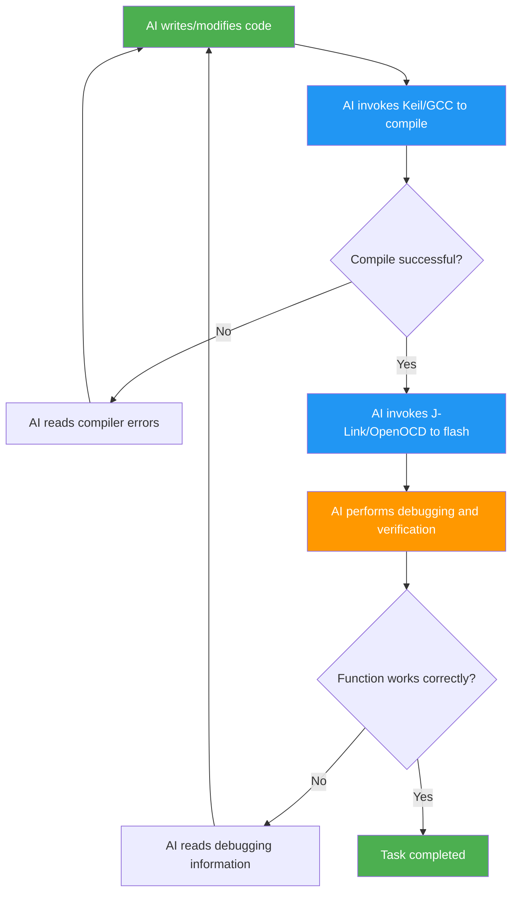

[简体中文](./README.md) | English

# embeddedskills — Embedded Development & Debugging Skills

**Give AI coding assistants direct control over compilers, debuggers, and communication buses — completing the last mile of embedded development automation.**


<p>
  
  
  
  
  
  
  
  
</p>

Compatible with Claude Code, Copilot, TRAE, and other AI coding assistants that support the Skill protocol.

If you find the project helpful, please give it a free 🌟.

## Motivation

AI coding assistants already excel at solution design and code writing, but embedded development differs from pure software — writing code is only the beginning. Compiling, flashing, and debugging still require manual effort. Every time AI modifies code, you have to compile, flash, observe, and feed error information back to AI manually. This loop is inefficient and constantly breaks flow.

This toolkit wraps embedded toolchain CLI capabilities into Skill interfaces, enabling AI to autonomously complete the full **write → compile → flash → debug → fix** loop:



| Phase | Traditional AI Assistance | AI + Skills |
|-------|---------------------------|-------------|
| Code writing | AI-generated | AI-generated |
| Compile/build | Manual | AI invokes Keil / GCC |
| Flash/download | Manual | AI invokes J-Link / OpenOCD |
| Debug/verification | Manual | AI breakpoints / registers / memory |
| Communication debug | Manual | AI serial / CAN / network |
| Error fixing | Human relays to AI | AI reads and fixes autonomously |

## How It Works

- **Wraps CLI tools** — Each Skill is a set of Python scripts that convert underlying tools (UV4.exe, cmake, JLink.exe, openocd, tshark, etc.) into structured subcommands
- **Exposed to AI via SKILL.md** — Each Skill directory contains a `SKILL.md` that describes capabilities, subcommands, and usage scenarios in natural language. AI reads it and invokes accordingly
- **Unified JSON output** — All scripts return a unified JSON format (status, summary, details, artifact paths, next actions, etc.) for AI to parse and decide next steps

## Usage: Auto-Orchestration + Manual Composition

- **Auto-orchestration** — `workflow` serves as the main Skill, automatically detecting project type (Keil / GCC), discovering available debug tools and communication interfaces, and coordinating sub-Skills for the complete flow
- **Manual invocation** — Each Skill can be used independently for specific tasks (e.g., `jlink flash` for flashing, `serial monitor` for serial monitoring)

```
Auto-orchestration:                   Manual invocation:

workflow                              User / AI calls directly
  ├─ Detect project → keil or gcc       ├─ keil build
  ├─ Select tool → jlink or openocd     ├─ jlink flash
  ├─ Select channel → serial/can/net    ├─ serial monitor
  └─ Aggregate results → decide next    └─ ...
```

## Skill Overview

| Category | Skill | Purpose | Subcommands |
|----------|-------|---------|-------------|
| **Build** | **keil** | Keil MDK project scan, Target enumeration, build, rebuild, clean | `scan` `targets` `build` `rebuild` `clean` `flash` |
| | **gcc** | CMake-based GCC embedded project scan, preset enumeration, configure, build, size analysis | `scan` `presets` `configure` `build` `rebuild` `clean` `size` |
| **Debug** | **jlink** | J-Link flashing, memory/register access, RTT/SWO, on-target debugging, GDB | `info` `flash` `read-mem` `write-mem` `regs` `reset` `rtt` `swo` `halt` `go` `step` `run-to` + GDB subcommands |
| | **openocd** | OpenOCD flashing, erase, low-level queries, GDB/Telnet debugging, semihosting/ITM | `probe` `flash` `erase` `reset` `reset-init` `targets` `flash-banks` `adapter-info` `raw` `gdb-server` + GDB/Telnet subcommands `semihosting` `itm` |
| **Comm** | **serial** | Serial port scan, live monitor, data send, hex view, logging | `scan` `monitor` `send` `hex` `log` |
| | **can** | CAN/CAN-FD interface scan, monitoring, frame sending, DBC decoding, statistics | `scan` `monitor` `send` `log` `decode` `stats` |
| | **net** | Packet capture, pcap analysis, connectivity testing, port scan, traffic statistics | `iface` `capture` `analyze` `ping` `scan` `stats` |
| **Orchestration** | **workflow** | Discover projects, select backends, chain workspace state, aggregate results | `plan` `build` `build-flash` `build-debug` `observe` `diagnose` |

> Build and debug layers are orthogonal: `Keil → J-Link`, `Keil → OpenOCD`, `GCC → J-Link`, `GCC → OpenOCD` are all valid. The `gcc` skill currently targets CMake-based arm-none-eabi-gcc projects only (no pure Makefile projects).

## Installation

### npx Install (Recommended)

```bash
# Install all skills globally
npx skills add https://github.com/luhao200/embeddedskills -g -y

# Install only one specific skill
npx skills add https://github.com/luhao200/embeddedskills --skill jlink -g -y

# Management
npx skills ls -g        # List installed
npx skills update -g    # Update
npx skills remove -g    # Remove
```

### Clone Locally

```bash
# Global
git clone https://github.com/luhao200/embeddedskills ~/.claude/skills/embeddedskills

# Current project only
git clone https://github.com/luhao200/embeddedskills .claude/skills/embeddedskills
```

### Configuration

#### Environment-level Configuration (Required)

Copy each skill's `config.example.json` to `config.json` and fill in local tool paths:

```bash
cd ~/.claude/skills/embeddedskills/jlink
cp config.example.json config.json
# Edit config.json — set JLink.exe path and other environment parameters
```

> `config.json` is excluded by `.gitignore` and will not be committed.

#### Project-level Configuration (Optional)

Create `.embeddedskills/config.json` in the project root to store project defaults:

```bash
mkdir -p .embeddedskills
# Create config.json and fill in project default parameters
```

> The `.embeddedskills/` directory is excluded by `.gitignore` and will not be committed.

### External Dependencies

| Skill | Dependencies |
|-------|-------------|
| keil | Keil MDK (UV4.exe) |
| gcc | CMake, Ninja/Make, ARM GNU Toolchain |
| jlink | SEGGER J-Link Software, arm-none-eabi-gdb |
| openocd | OpenOCD, debugger drivers (ST-Link / CMSIS-DAP / DAPLink / FTDI) |
| serial | pyserial + USB-to-serial driver |
| can | python-can, cantools, pyserial + USB-CAN driver |
| net | Wireshark (tshark), Npcap |

## Architecture

### Skill Directory Structure

```
<skill>/
├── SKILL.md            # Metadata and execution rules (read by AI)
├── config.json         # Local configuration (excluded by .gitignore)
├── config.example.json # Configuration template
├── scripts/            # Python scripts
└── references/         # Reference data (JSON/Markdown)
```

### Output Format

All scripts return unified JSON:

```json
{
  "status": "ok|error",
  "action": "...",
  "summary": "short summary",
  "details": {},
  "artifacts": {},
  "next_actions": []
}
```

Full schema also includes `context`, `metrics`, `state`, `timing`. Streaming commands use JSON Lines.

### Configuration Layers

This toolkit uses a three-layer configuration structure:

| Layer | File Location | Purpose | Example Content |
|-------|---------------|---------|-----------------|
| **Environment-level** | `skill/config.json` | Tool paths, local hardware parameters | `uv4_exe` path, `jlink_exe` path |
| **Project-level shared** | `workspace/.embeddedskills/config.json` | Project defaults grouped by skill | Target chip, interface, log directories |
| **Runtime state** | `workspace/.embeddedskills/state.json` | Runtime state only | `last_build`, `last_flash`, `last_debug`, `last_observe` |

#### Project-level Configuration Full Structure Example

```json
{
  "workflow": {
    "preferred_build": "auto",
    "preferred_flash": "auto",
    "preferred_debug": "auto",
    "preferred_observe": "auto"
  },
  "keil": { "project": "", "target": "", "log_dir": ".embeddedskills/build" },
  "gcc": { "project": "", "preset": "", "log_dir": ".embeddedskills/build" },
  "jlink": { "device": "", "interface": "SWD", "speed": "4000" },
  "openocd": { "board": "", "interface": "", "target": "", "adapter_speed": "", "transport": "", "tpiu_name": "", "traceclk": "", "pin_freq": "" },
  "serial": { "port": "", "baudrate": 115200, "bytesize": 8, "parity": "none", "stopbits": 1, "encoding": "utf-8", "timeout_sec": 1.0, "log_dir": ".embeddedskills/logs/serial" },
  "can": { "interface": "", "channel": "", "bitrate": 0, "data_bitrate": 0, "log_dir": ".embeddedskills/logs/can" },
  "net": { "interface": "", "target": "", "capture_filter": "", "display_filter": "", "duration": 30, "timeout_ms": 1000, "scan_ports": "", "capture_format": "pcapng", "log_dir": ".embeddedskills/logs/net" }
}
```

#### Unified Log Directories

| Type | Directory |
|------|-----------|
| Build logs | `.embeddedskills/build` |
| Serial logs | `.embeddedskills/logs/serial` |
| CAN logs | `.embeddedskills/logs/can` |
| Network logs | `.embeddedskills/logs/net` |

#### Parameter Resolution Order

1. CLI arguments
2. `skill/config.json` (environment-level)
3. `.embeddedskills/config.json` (project-level)
4. `.embeddedskills/state.json` (runtime state)
5. Local detection/search
6. Prompt user

#### Configuration Write-back Rules

| Configuration Type | Write-back Location |
|-------------------|---------------------|
| Environment-level values | `skill/config.json` |
| Project-level values | `.embeddedskills/config.json` |
| Runtime state | `.embeddedskills/state.json` |

### Operation Modes

Skills with execution risk can be controlled by `operation_mode` in `config.json` (currently mainly `keil`, `gcc`, `jlink`, and `openocd`):

| Mode | Description |
|------|-------------|
| 1 | Execute immediately |
| 2 | Show risk summary, no blocking |
| 3 | Require confirmation before execution |

### Design Principles

- Do not guess critical parameters — device model, interface, port must be specified explicitly
- List candidates when multiple options exist — never auto-select
- Provide troubleshooting suggestions on failure
- Pure Python standard library (except CAN and serial)

## Progress

| Skill | Status |
|-------|--------|
| keil | ✅ Tested |
| gcc | ✅ Tested |
| jlink | ✅ Tested |
| serial | ✅ Tested |
| net | ✅ Tested |
| openocd | ✅ Tested |
| workflow | ✅ Tested |
| can | 🔧 Pending test |

## License

MIT — see [LICENSE](LICENSE).
