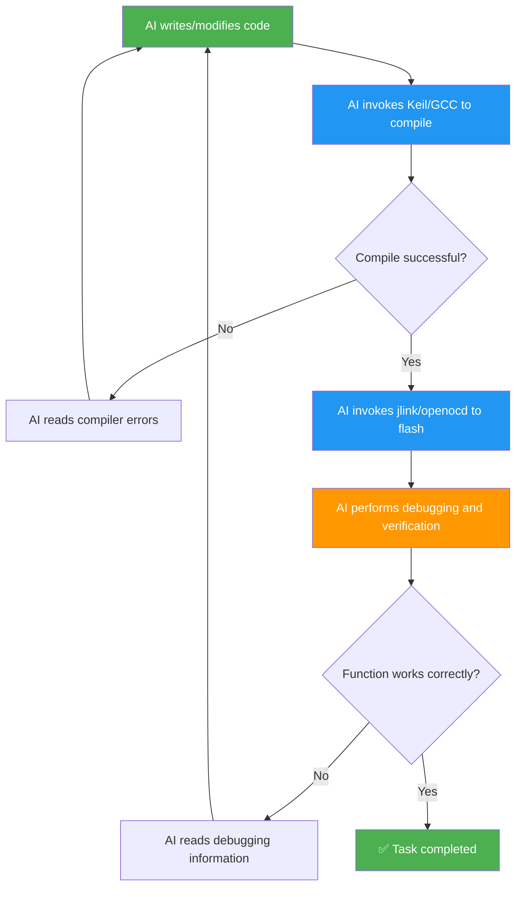
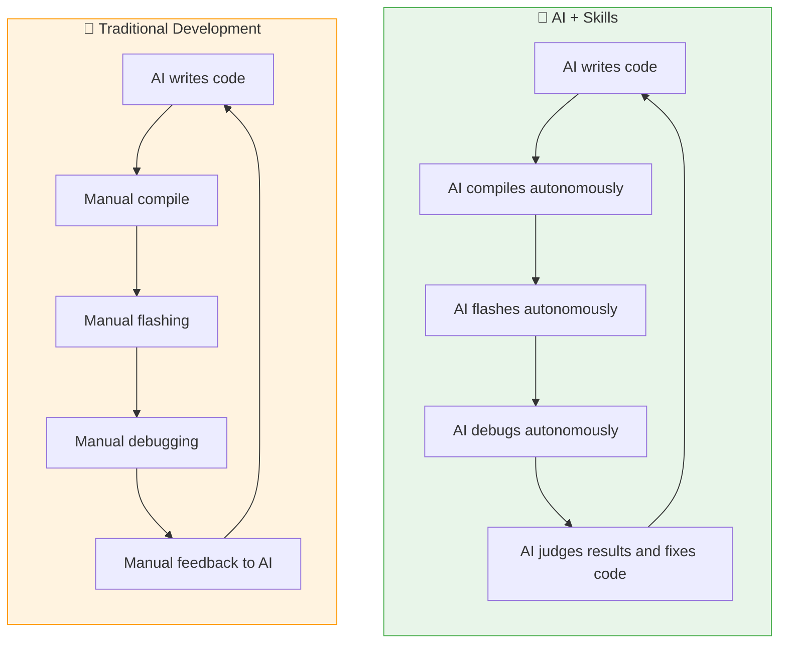
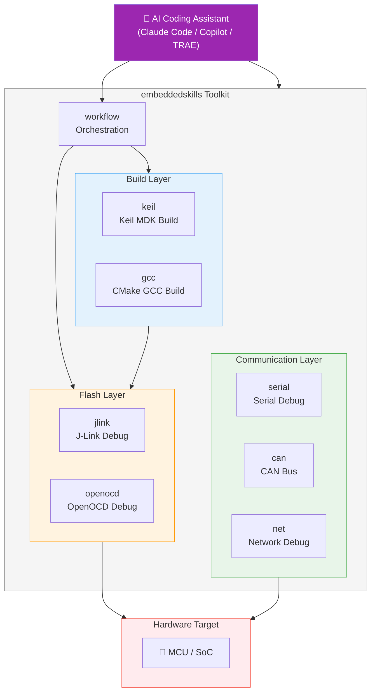

[简体中文](./README.md) | English

# embeddedskills — Embedded Development & Debugging Toolkit

**Enable AI to do more than write code — let it compile, flash, and debug, completing the last mile of embedded development automation.**

This is an open-source collection of embedded development and debugging skills for Claude Code, Copilot, TRAE, and other AI coding assistants that support the Skill protocol. Once installed, the AI assistant can directly operate compilers, debuggers, and communication buses, automating the full workflow from code generation to hardware verification.

## Why is this toolkit needed?

### Current situation: AI only helps with half the job

Today's AI coding assistants (Claude, Copilot, TRAE, etc.) are already very effective for solution design and code writing. But embedded development is different from pure software development — writing code is only the beginning. Steps that interact with hardware, such as **compiling, flashing, and debugging**, still need to be done manually by developers.

```
In the traditional workflow, AI only covers the first half:

  What AI can do       ┃  What still needs humans
  ━━━━━━━━━━━━━━━━━━━━━╋━━━━━━━━━━━━━━━━━━━━━━━
  Solution design      ┃  Compile and build
  Code writing         ┃  Flash and download
  Code review          ┃  Breakpoint debugging
                       ┃  Serial/CAN/network debugging
                       ┃  Issue diagnosis and fixes
```

**Pain point:** Every time AI changes the code, you still need to compile manually, flash the firmware, observe the results, and feed the error information back to the AI. This loop is inefficient and constantly breaks flow.

### Solution: let AI close the loop on its own

This skill set gives AI assistants the ability to operate hardware toolchains, allowing them to complete the full development-debug cycle autonomously:



**Full workflow AI can execute autonomously:**

1. **Write code** → Generate or modify source files based on requirements
2. **Compile and check** → Invoke Keil / GCC, read build errors, and automatically fix code until the build succeeds
3. **Flash firmware** → Download firmware to the chip through J-Link / OpenOCD
4. **Breakpoint debugging** → Set breakpoints, single-step, inspect registers and memory
5. **Communication debugging** → Read runtime data through serial / CAN / network and judge program behavior
6. **Self-correction** → Adjust code automatically according to debugging results and repeat the loop until the feature meets expectations

### Traditional development vs AI-empowered development



| Item | Traditional AI assistance | AI + Skills |
|------|---------------------------|-------------|
| Code writing | ✅ AI-generated | ✅ AI-generated |
| Compile/build | ❌ Manual operation | ✅ AI invokes Keil / GCC autonomously |
| Flash/download | ❌ Manual operation | ✅ AI invokes J-Link/OpenOCD autonomously |
| Debug/verification | ❌ Manual operation | ✅ AI handles breakpoints/registers/memory |
| Communication debugging | ❌ Manual operation | ✅ AI handles serial/CAN/network |
| Error fixing | ❌ Human relays information to AI | ✅ AI reads results and fixes code directly |
| **Development loop** | **❌ Human in the loop** | **✅ Fully autonomous AI loop** |

## Architecture Overview



## Skill List

## Two-Dimensional Classification

### By Project Type

| Category | Detection | Primary responsibility |
|----------|-----------|------------------------|
| **Keil project** | Detect `.uvprojx/.uvmpw` project files | Project scan, Target enumeration, build |
| **GCC project** | Detect embedded CMake projects with `CMakeLists.txt` plus `CMakePresets.json` / toolchain files | Preset enumeration, configure, build, size |

> The current `gcc` skill explicitly targets **CMake-based arm-none-eabi-gcc projects**. It does not cover pure Makefile projects.

### By Debug Tool

| Category | Primary responsibility | Inputs |
|----------|------------------------|--------|
| **J-Link** | Flashing, register/memory access, RTT/SWO, on-target debugging, GDB debugging | Firmware path + chip/interface parameters |
| **OpenOCD** | Flashing, erase, reset, Telnet/GDB debugging, semihosting/ITM | Firmware path + board/interface/target parameters |

These two classifications are orthogonal. `Keil -> J-Link`, `Keil -> OpenOCD`, `GCC -> J-Link`, and `GCC -> OpenOCD` are all valid combinations. The build layer produces firmware paths, and the debug layer handles flashing and on-target debugging.

| Skill | Purpose | Subcommands |
|-------|---------|-------------|
| **keil** | Keil MDK project scan, Target enumeration, build, rebuild, clean; `flash` is retained as a compatibility entry | `scan` `targets` `build` `rebuild` `clean` `flash` |
| **gcc** | CMake-based GCC embedded project scan, preset enumeration, configure, build, and size analysis | `scan` `presets` `configure` `build` `rebuild` `clean` `size` |
| **jlink** | J-Link flashing, memory access, registers, RTT/SWO, on-target debugging, and one-shot GDB | `info` `flash` `read-mem` `write-mem` `regs` `reset` `rtt` `swo` `halt` `go` `step` `run-to` `gdb backtrace` `gdb locals` `gdb break` `gdb continue` `gdb next` `gdb step` `gdb finish` `gdb until` `gdb frame` `gdb print` `gdb watch` `gdb disassemble` `gdb threads` `gdb crash-report` |
| **openocd** | OpenOCD flashing, erase, low-level queries, GDB/Telnet debugging, semihosting/ITM | `probe` `flash` `erase` `reset` `reset-init` `targets` `flash-banks` `adapter-info` `raw` `gdb server` `gdb backtrace` `gdb locals` `gdb break` `gdb continue` `gdb next` `gdb step` `gdb finish` `gdb until` `gdb frame` `gdb print` `gdb watch` `gdb disassemble` `gdb threads` `gdb crash-report` `semihosting` `itm` |
| **workflow** | Discover projects, select backends, chain workspace state, aggregate results | `plan` `build` `build-flash` `build-debug` `observe` `diagnose` |
| **serial** | Serial port scan, live monitor, data send, hex view, and logging | `scan` `monitor` `send` `hex` `log` |
| **can** | CAN/CAN-FD interface scan, monitoring, frame sending, and DBC decoding | `scan` `monitor` `send` `log` `decode` `stats` |
| **net** | Packet capture, pcap analysis, connectivity testing, and port scan | `iface` `capture` `analyze` `ping` `scan` `stats` |

## Installation

### Method 1: Install with npx (recommended)

```bash
# Install all skills globally
npx skills add https://github.com/luhao200/embeddedskills -g -y

# Install only one specific skill
npx skills add https://github.com/luhao200/embeddedskills --skill jlink -g -y
```

Common management commands:

```bash
npx skills ls -g        # List installed skills
npx skills update -g    # Update
npx skills remove -g    # Remove
```

### Method 2: Clone locally

```bash
# Clone the repository into the skill directory (global effect)
git clone https://github.com/luhao200/embeddedskills ~/.claude/skills/embeddedskills

# Or use it only for the current project (under the project root)
git clone https://github.com/luhao200/embeddedskills .claude/skills/embeddedskills
```

### Configuration

After installation, copy the `config.example.json` of the skill you want to use to `config.json`, then fill in the actual local paths and parameters:

```bash
cd ~/.claude/skills/embeddedskills/jlink
cp config.example.json config.json
# Edit config.json and fill in the JLink.exe path, default chip model, etc.
```

> `config.json` is excluded by `.gitignore` and will not be committed.

### Dependencies

| Skill | External dependencies |
|-------|------------------------|
| keil | Keil MDK (UV4.exe) |
| gcc | CMake, Ninja/Make, ARM GNU Toolchain |
| jlink | SEGGER J-Link Software, arm-none-eabi-gdb |
| openocd | OpenOCD, debugger drivers (ST-Link/CMSIS-DAP/DAPLink/FTDI) |
| serial | `pip install pyserial` + USB-to-serial driver |
| can | `pip install python-can cantools pyserial` + USB-CAN driver |
| net | Wireshark (tshark), Npcap |

## Detailed Skill Descriptions

### keil — Keil MDK Build

Scans `.uvprojx` / `.uvmpw` project files, enumerates Targets, performs incremental build / full rebuild / clean, and parses build logs to extract error count, warning count, code size, and other information. Build results also try to return artifact paths such as `flash_file` and `debug_file` so they can be passed to J-Link or OpenOCD. The `flash` subcommand is kept for compatibility, not as the preferred main path.

**Implementation:** Python scripts invoke the UV4.exe command line, then parse the return code, build logs, and output directory metadata. Flashing is only allowed when the build completes without errors.

---

### gcc — CMake-Based GCC Embedded Build

Scans projects that contain `CMakeLists.txt` plus either `CMakePresets.json` or embedded toolchain files, enumerates presets, runs configure / build / rebuild / clean, and analyzes ELF size. Build results return `elf_file`, which can be passed directly to J-Link or OpenOCD for downstream debugging.

**Implementation:** Python scripts invoke `cmake --preset`, `cmake --build`, and `arm-none-eabi-size`, then parse logs, build directories, and ELF artifacts.

---

### jlink — J-Link Probe Debugging

**Basic operations:** probe detection (`info`), firmware flashing (`flash`), memory read/write (`read-mem` / `write-mem`), register inspection (`regs`), target reset (`reset`), RTT logging (`rtt`)

**Lightweight debugging:** halt (`halt`) / resume (`go`) / single-step (`step`) / run to breakpoint (`run-to`)

**Source-level debugging through GDB:** unified one-shot commands for `backtrace / locals / break / continue / next / step / finish / until / frame / print / watch / disassemble / threads / crash-report`

**Observe channels:** RTT (`rtt`) and pluggable SWO wrapper (`swo`)

**Implementation:**
- `jlink_exec.py` — generates a `.jlink` command script and executes it with JLink.exe
- `jlink_rtt.py` — starts JLinkGDBServerCL + JLinkRTTClient to read RTT output
- `jlink_gdb.py` — starts the GDB server and runs unified one-shot debug subcommands
- `jlink_swo.py` — wraps an external SWO viewer into the common event stream protocol

---

### openocd — OpenOCD Debugging and Flashing

Probe detection (`probe`), firmware flashing (`flash`), flash erase (`erase`), target reset (`reset` / `reset-init`), low-level queries (`targets` / `flash-banks` / `adapter-info` / `raw`), unified GDB subcommands, and semihosting/ITM observation.

**Implementation:** Python scripts assemble and execute OpenOCD command-line arguments. Board configuration takes priority over interface + target combinations. GDB debugging uses a unified one-shot command surface, and `openocd_itm.py` reuses official TPIU/ITM commands.

**Supported debuggers:** ST-Link V2/V3, CMSIS-DAP, DAPLink, J-Link, FTDI

---

### serial — Serial Debugging

Scans available serial ports (`scan`), performs live text monitoring (`monitor`), sends text/hex data (`send`), displays binary hex output (`hex`), and records logs (`log`).

**Implementation:** Five standalone scripts based on pyserial. Streaming commands use JSON Lines output. Supports regex filtering and multiple log formats (text/csv/json). Includes built-in USB-to-serial VID/PID mappings for chips such as CH340, CP2102, FT232, and PL2303.

---

### can — CAN Bus Debugging

Interface scan (`scan`), live monitoring (`monitor`), frame sending (`send`), traffic logging (`log`), DBC/ARXML/KCD database decoding (`decode`), and bus statistics (`stats`).

**Implementation:** Six scripts based on python-can + cantools, supporting multiple backends including PCAN, Vector, IXXAT, Kvaser, slcan, socketcan, gs_usb, and virtual.

---

### net — Network Debugging

Interface discovery (`iface`), live packet capture (`capture`), offline pcap analysis (`analyze`), connectivity testing (`ping`), port scan (`scan`), and traffic statistics (`stats`).

**Implementation:** Six scripts based on tshark / capinfos. The port scan covers common embedded ports by default, including Modbus TCP, MQTT, CoAP, OPC UA, S7comm, BACnet, and EtherNet/IP.

---

### workflow — Orchestration

Discovers Keil / GCC projects in the current workspace, selects build/flash/debug/observe backends, and chains the latest results through `.embeddedskills/state.json`.

**Implementation:**
- `workflow_plan.py` — discovers projects, backend candidates, and recent state
- `workflow_run.py` — thin orchestration entry that calls existing skill scripts and aggregates results

---

## Common Architecture

### Directory Structure

Each skill uses the following directory structure:

```
<skill>/
├── SKILL.md            # Skill metadata and execution rules (required)
├── README.md           # User documentation
├── config.json         # Current configuration (excluded by .gitignore)
├── config.example.json # Configuration template
├── scripts/            # Python scripts
└── references/         # Reference data (JSON/Markdown)
```

### Unified Output Format

```json
{
  "status": "ok|error",
  "action": "...",
  "summary": "short summary",
  "details": {},
  "context": {},
  "artifacts": {},
  "metrics": {},
  "state": {},
  "next_actions": [],
  "timing": {}
}
```

The compatibility layer still preserves the base `{status, action, summary, details}` fields. Streaming commands use JSON Lines and include `source / channel_type / stream_type`.

### Workspace Shared State

Runtime state is stored in `.embeddedskills/state.json` inside the current workspace, not in a user-global directory. It currently records at least:

- `last_build`
- `last_flash`
- `last_debug`
- `last_observe`

### Operation Modes

Controlled by `operation_mode` in `config.json`:

| Mode | Description |
|------|-------------|
| 1 | Execute immediately |
| 2 | Show a risk summary without blocking |
| 3 | Require confirmation before execution |

### Design Principles

- **Do not guess critical parameters** — device model, interface, port, and similar inputs must be specified explicitly
- **List candidates when multiple options exist** — never auto-select
- **Provide troubleshooting suggestions on failure**
- **Implemented with the Python standard library only** (except CAN and serial, which require python-can / pyserial)

## Progress Status

| Skill | Status |
|-------|--------|
| keil | ✅ Tested and completed |
| gcc | ✅ Tested and completed |
| jlink | ✅ Tested and completed |
| workflow | 🔧 Pending testing |
| serial | ✅ Tested and completed |
| net | ✅ Tested and completed |
| openocd | 🔧 Pending testing |
| can | 🔧 Pending testing |

## License

MIT
