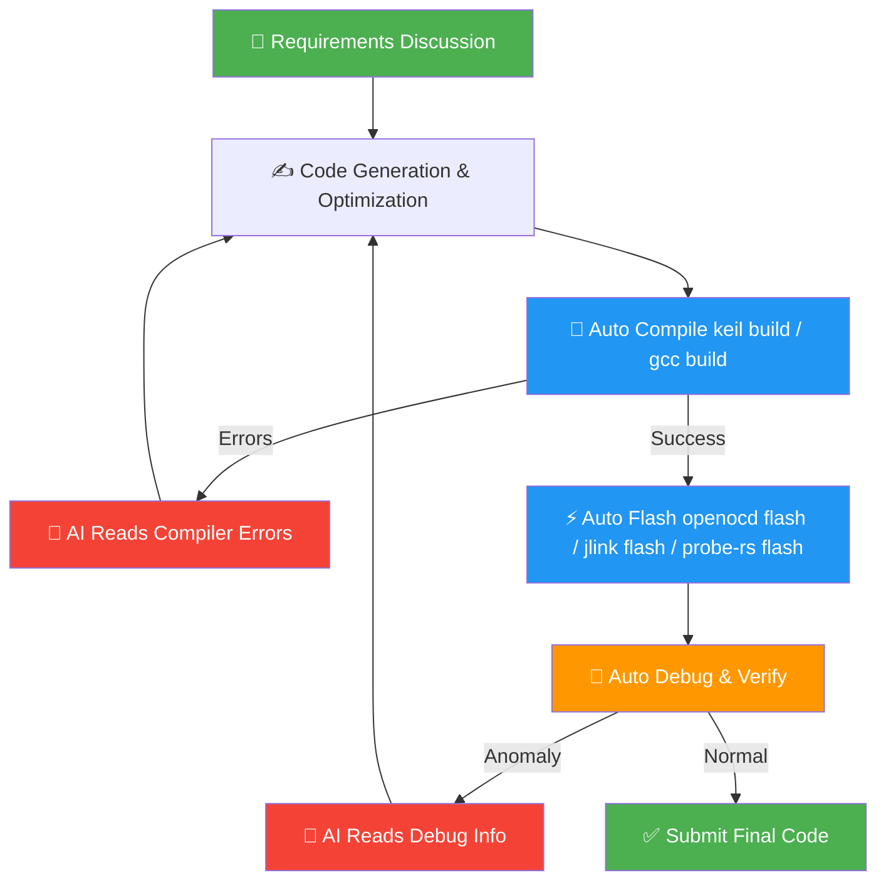
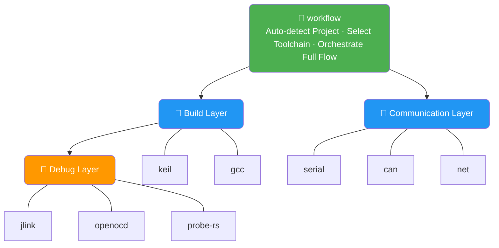

<div align="center">

[简体中文](./README.md) | English

# embeddedskills — Embedded Development & Debugging Skills

### Give AI coding assistants direct control over compilers, debuggers, and communication buses — completing the last mile of embedded development automation.

[](LICENSE)
[]()
[](https://github.com/zhinkgit/embeddedskills/stargazers)
<br><br>


<br>

**No more manual compiling, no more manual flashing, no more manual debugging.**<br>
AI autonomously completes the entire process from writing code to verifying functionality.

<br>

If you find this project helpful, please give it a free ⭐

</div>

---

## Why You Need It

Embedded development has a gap that pure software development doesn't have: writing code is just the beginning — compiling, flashing, and debugging all require human intervention at every step.

> AI modifies code → **You** manually compile → **You** manually flash → **You** copy errors to AI → AI fixes → **You** compile again...

**embeddedskills hands this loop over to AI:**



<br>

<div align="center">

|  | Traditional AI Assistance | AI + embeddedskills |
|:---:|:---:|:---:|
| Code Writing | ✅ AI | ✅ AI |
| Compile/Build | 🙋 You | 🤖 AI invokes Keil / GCC |
| Flash/Download | 🙋 You | 🤖 AI invokes J-Link / OpenOCD / probe-rs |
| Debug/Verify | 🙋 You | 🤖 AI breakpoints / registers / memory |
| Communication Debug | 🙋 You | 🤖 AI serial / CAN / network |
| Error Fixing | 🙋 You copy errors to AI | 🤖 AI reads and fixes autonomously |

</div>

---

## Skill Overview




<br>

| Category | Skill | What It Does | Main Subcommands |
|:---:|:---:|---|---|
| 🔨 Build | **keil** | Keil MDK project scan, Target enumeration, compile, rebuild, clean | `scan` `targets` `build` `rebuild` `clean` `flash` |
| 🔨 Build | **gcc** | CMake-based GCC project configuration, compile, size analysis | `scan` `presets` `configure` `build` `rebuild` `size` |
| 🔬 Debug | **jlink** | Flash, read/write memory/registers, RTT/SWO, GDB debug | `flash` `read-mem` `write-mem` `regs` `rtt` `swo` + GDB |
| 🔬 Debug | **openocd** | Flash, erase, GDB/Telnet, Semihosting/ITM | `flash` `erase` `reset` `gdb-server` `semihosting` `itm` |
| 🔬 Debug | **probe-rs** | Probe discovery, flashing, reset, memory access, GDB debug, RTT | `list` `info` `flash` `erase` `reset` `read-mem` `write-mem` `gdb` `rtt` |
| 🔌 Communication | **serial** | Scan serial ports, real-time monitor, send data, hex view | `scan` `monitor` `send` `hex` `log` |
| 🔌 Communication | **can** | CAN/CAN-FD monitoring, send frames, DBC decode, statistics | `scan` `monitor` `send` `decode` `stats` |
| 🔌 Communication | **net** | Packet capture analysis, connectivity test, port scan, traffic stats | `capture` `analyze` `ping` `scan` `stats` |
| 🎯 Orchestration | **workflow** | Auto-detect project → Select toolchain → Orchestrate full flow | `plan` `build` `build-flash` `build-debug` `observe` `diagnose` |

> [!TIP]
> `Keil / GCC` and `J-Link / OpenOCD / probe-rs` can be freely combined orthogonally — all six combinations work out of the box.

---

## Installation

### Method 1: npx (Recommended)

```bash
# One-click install all skills
npx skills add https://github.com/zhinkgit/embeddedskills -g -y

# Install only specific skill (e.g., only openocd)
npx skills add https://github.com/zhinkgit/embeddedskills --skill openocd -g -y

# Management
npx skills ls -g        # List installed
npx skills update -g    # Update to latest
npx skills remove -g    # Remove
```

### Method 2: Direct Clone

```bash
# Claude Code (global)
git clone https://github.com/zhinkgit/embeddedskills.git ~/.claude/skills/embeddedskills

# Codex (global)
git clone https://github.com/zhinkgit/embeddedskills.git ~/.codex/skills

# Codex (current project only)
git clone https://github.com/zhinkgit/embeddedskills.git .codex/skills
```

> [!NOTE]
> **[→ Full Installation & Usage Guide](docs/getting-started.en.md)** — includes screenshot demonstrations and configuration instructions.

---

## How It Works

Three key designs enable true autonomous AI closed-loop:

<details>
<summary><b>① Wrap CLI Tools</b></summary>

Each Skill is a set of Python scripts that convert underlying tools (UV4.exe, cmake, JLink.exe, openocd, probe-rs, tshark, etc.) CLI parameters and interactive flows into structured subcommands, allowing AI to call these tools like functions.

</details>

<details>
<summary><b>② Expose to AI via SKILL.md</b></summary>

Each Skill directory contains a `SKILL.md` that describes capabilities, subcommands, and usage scenarios in natural language. After reading it, AI can invoke correctly — **no additional training or configuration needed**, any AI tool supporting the Skill protocol works out of the box.

</details>

<details>
<summary><b>③ Unified JSON Output Drives Next Decisions</b></summary>

All scripts return a unified JSON structure that AI parses directly for status, summary, and recommendations to autonomously decide next actions:

```json
{
  "status": "ok | error",
  "action": "build",
  "summary": "Build successful, 0 errors, 2 warnings",
  "details": { "warnings": ["unused variable 'x' at main.c:42"] },
  "artifacts": { "hex": ".embeddedskills/build/output.hex" },
  "next_actions": ["flash to device"]
}
```

</details>

<br>

**Three-layer configuration**, override as needed, priority from high to low:

```
CLI args  ──►  skill/config.json (tool paths, hardware params)
          ──►  .embeddedskills/config.json (target chip, interface, log dirs)
          ──►  .embeddedskills/state.json (last build/flash/debug record)
          ──►  Defaults
```

**Unified Log Directories:**

```
workspace/
└── .embeddedskills/
    ├── build/          ← Build logs and hex/bin artifacts
    └── logs/
        ├── serial/     ← Serial monitor logs
        ├── can/        ← CAN message logs
        └── net/        ← Network capture files
```

---

## External Dependencies

<details>
<summary>Expand to view dependencies for each Skill</summary>

| Skill | Dependencies |
|---|---|
| keil | Keil MDK (UV4.exe) |
| gcc | CMake · Ninja/Make · ARM GNU Toolchain |
| jlink | SEGGER J-Link Software · arm-none-eabi-gdb |
| openocd | OpenOCD · Debugger drivers (ST-Link / CMSIS-DAP / DAPLink / FTDI) |
| probe-rs | probe-rs CLI · arm-none-eabi-gdb |
| serial | pyserial · USB-to-serial driver |
| can | python-can · cantools · pyserial · USB-CAN driver |
| net | Wireshark (tshark) · Npcap |

> Except for CAN and serial, all Skills are implemented using Python standard library — no additional Python dependencies needed.

> [!WARNING]
> On Windows, using `probe-rs` with `J-Link` typically requires switching the probe driver to `WinUSB`, which can break the official SEGGER tooling. If you still rely on the SEGGER toolchain, prefer the existing `jlink` skill.

</details>

---

## Progress

| Skill | Status |
|---|:---:|
| keil | ✅ Tested |
| gcc | ✅ Tested |
| jlink | ✅ Tested |
| openocd | ✅ Tested |
| probe-rs | 🔧 Pending |
| serial | ✅ Tested |
| net | ✅ Tested |
| workflow | ✅ Tested |
| can | 🔧 Pending test |

---

## Star History

<a href="https://www.star-history.com/?repos=zhinkgit%2Fembeddedskills&type=date&legend=top-left">
 <picture>
   <source media="(prefers-color-scheme: dark)" srcset="https://api.star-history.com/image?repos=zhinkgit/embeddedskills&type=date&theme=dark&legend=top-left" />
   <source media="(prefers-color-scheme: light)" srcset="https://api.star-history.com/image?repos=zhinkgit/embeddedskills&type=date&legend=top-left" />
   
 </picture>
</a>

Welcome to submit Issues and PRs. Thanks to the [Linux.do](https://linux.do/) community for their support.
