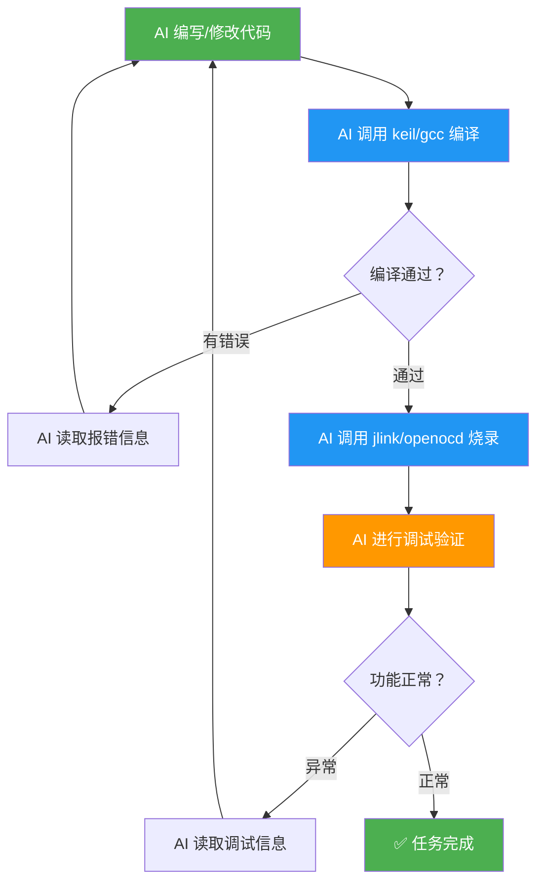
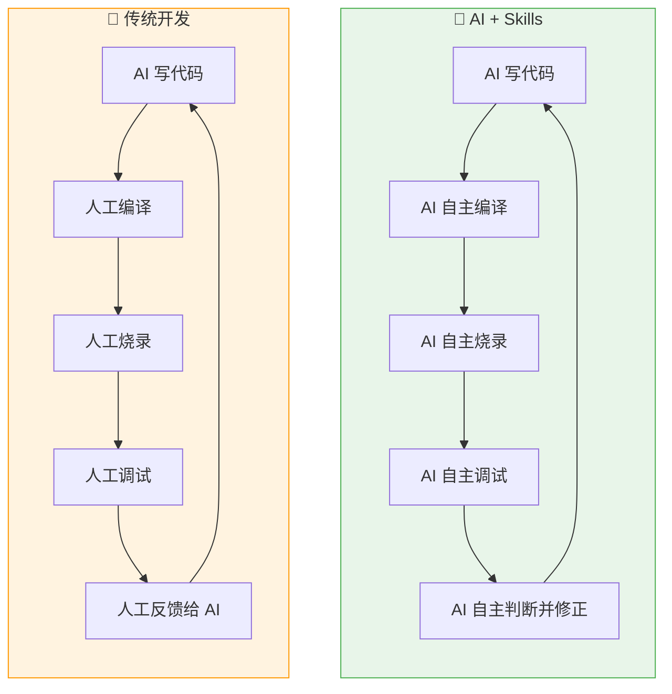

简体中文 | [English](./README.en.md)

# embeddedskills — 嵌入式开发调试工具集

**让 AI 不止写代码，还能编译、烧录、调试——补上嵌入式开发自动化的最后一环。**

一套开源的嵌入式开发调试 Skill 集合，适用于 Claude Code、Copilot、TRAE 及其他支持 Skill 协议的 AI 编码助手。安装后，AI 助手即可直接操控编译器、调试器和通信总线，实现从代码编写到硬件验证的全流程自动化。

## 核心原理

本工具集的核心思路是：**将嵌入式工具链的命令行能力封装为 AI 可理解、可调用的 Skill 接口**。

- **封装命令行工具为 Skill** — 每个 Skill 本质上是一组 Python 脚本，它们对底层命令行工具（如 UV4.exe、cmake、JLink.exe、openocd、tshark 等）进行封装，将复杂的命令行参数和交互流程转化为结构化的子命令接口
- **通过 SKILL.md 暴露给 AI** — 每个 Skill 目录下的 `SKILL.md` 文件以自然语言描述该 Skill 的能力、子命令、参数和使用场景，AI 助手通过读取该文件即可理解并正确调用对应功能
- **统一 JSON 输出供 AI 解析** — 所有脚本的执行结果均以统一的 JSON 格式返回（包括状态、摘要、详情、产物路径、下一步建议等），AI 可直接解析结果并据此决策下一步操作

这一设计使 AI 不仅能编写代码，还能**自主调用编译器编译、通过调试器烧录和调试、借助串口/CAN/网络读取运行数据**，从而独立完成完整的嵌入式开发-调试闭环。

## 核心特性：自动编排 + 灵活组合

本工具集提供两种互补的使用方式：

- **自动编排（workflow）** — `workflow` 作为主 Skill，能够自动扫描当前项目类型（Keil / GCC），发现可用的调试工具（J-Link / OpenOCD）和通信接口（串口 / CAN / 网络），自动选择并协调相应的子 Skill 完成编译→烧录→调试→观测的完整流程，开箱即用
- **手动选择** — 每个 Skill 都可以独立使用，用户可根据具体的项目需求和现有工具链，手动指定某个 Skill 单独执行特定任务（例如只用 `jlink flash` 烧录，或只用 `serial monitor` 监控串口）

```
自动编排模式：                        手动选择模式：

workflow                              用户 / AI 直接调用
  ├─ 识别工程 → keil 或 gcc 编译        ├─ keil build
  ├─ 选择工具 → jlink 或 openocd 烧录   ├─ jlink flash
  ├─ 选择通道 → serial / can / net 观测  ├─ serial monitor
  └─ 聚合结果 → 决策下一步               └─ ...
```

这种设计的优势在于：**既提供了开箱即用的自动化工作流（适合完整的开发-调试循环），又保留了针对特定场景的灵活配置能力（适合只需执行某个环节的情况）**。AI 助手可以根据任务复杂度自行选择——复杂任务用 workflow 自动编排，简单操作直接调用对应 Skill。

## 为什么需要这套工具？

### 现状：AI 只能帮你写一半

当前的 AI 编码助手（Claude、Copilot、TRAE 等）已经能很好地辅助方案设计和代码编写。但嵌入式开发不同于纯软件——写完代码只是开始，**编译、烧录、调试**这些与硬件打交道的步骤仍然需要开发者手动完成。

```
传统流程中 AI 只能覆盖前半段：

  AI 能做的          ┃  仍需人工的
  ━━━━━━━━━━━━━━━━━━━╋━━━━━━━━━━━━━━━━━━━
  方案设计            ┃  编译构建
  代码编写            ┃  烧录下载
  代码审查            ┃  断点调试
                     ┃  串口/CAN/网络调试
                     ┃  问题定位与修复
```

**痛点**：每次 AI 改完代码，你都要手动编译、烧录、观察结果、再把错误信息喂回给 AI——这个循环既低效又打断心流。

### 解决方案：让 AI 自己闭环

这套 Skill 赋予 AI 助手操控硬件工具链的能力，使其能够自主完成完整的开发-调试循环：



**AI 可以自主执行的完整流程：**

1. **编写代码** → 根据需求生成或修改源文件
2. **编译检查** → 调用 Keil / GCC 编译，读取报错，自动修改直至编译通过
3. **烧录程序** → 通过 J-Link / OpenOCD 将固件下载到芯片
4. **断点调试** → 设置断点、单步执行、查看寄存器和内存
5. **通信调试** → 通过串口 / CAN / 网络读取运行数据，判断程序行为
6. **自我修正** → 根据调试结果自动调整代码，重复上述循环直到功能达标

### 传统开发 vs AI 赋能开发



| 对比项 | 传统 AI 辅助 | AI + Skills |
|--------|-------------|-------------|
| 代码编写 | ✅ AI 生成 | ✅ AI 生成 |
| 编译构建 | ❌ 人工操作 | ✅ AI 自主调用 Keil / GCC |
| 烧录下载 | ❌ 人工操作 | ✅ AI 自主调用 J-Link/OpenOCD |
| 调试验证 | ❌ 人工操作 | ✅ AI 自主断点/寄存器/内存 |
| 通信调试 | ❌ 人工操作 | ✅ AI 自主串口/CAN/网络 |
| 错误修正 | ❌ 人工转述给 AI | ✅ AI 自主读取并修正 |
| **开发闭环** | **❌ 人在回路** | **✅ AI 自主闭环** |

## Skill 一览

| 分类 | Skill | 用途 | 子命令 |
|------|-------|------|--------|
| **构建** | **keil** | Keil MDK 工程扫描、Target 枚举、编译、重建、清理 | `scan` `targets` `build` `rebuild` `clean` `flash` |
| | **gcc** | CMake 型 GCC 嵌入式工程扫描、preset 枚举、配置、编译、大小分析 | `scan` `presets` `configure` `build` `rebuild` `clean` `size` |
| **调试** | **jlink** | J-Link 烧录、读写内存/寄存器、RTT/SWO、在线调试、GDB 调试 | `info` `flash` `read-mem` `write-mem` `regs` `reset` `rtt` `swo` `halt` `go` `step` `run-to` + GDB 子命令 |
| | **openocd** | OpenOCD 烧录、擦除、底层查询、GDB/Telnet 调试、Semihosting/ITM | `probe` `flash` `erase` `reset` `reset-init` `targets` `raw` + GDB 子命令 `semihosting` `itm` |
| **通信** | **serial** | 串口扫描、实时监控、数据发送、Hex 查看、日志 | `scan` `monitor` `send` `hex` `log` |
| | **can** | CAN/CAN-FD 接口扫描、监控、发帧、DBC 解码、统计 | `scan` `monitor` `send` `log` `decode` `stats` |
| | **net** | 抓包、pcap 分析、连通性测试、端口扫描、流量统计 | `iface` `capture` `analyze` `ping` `scan` `stats` |
| **编排** | **workflow** | 发现工程、选择后端、串联 workspace 状态、聚合结果 | `plan` `build` `build-flash` `build-debug` `observe` `diagnose` |

> **构建与调试正交组合**：`Keil → J-Link`、`Keil → OpenOCD`、`GCC → J-Link`、`GCC → OpenOCD` 均可成立。构建层产出固件路径，调试层负责烧录和在线调试。
>
> `gcc` skill 当前面向 **CMake 型 arm-none-eabi-gcc 工程**，不包含纯 Makefile 工程。

## 安装

### 方法一：npx 安装（推荐）

```bash
# 安装全部 skill（全局）
npx skills add https://github.com/luhao200/embeddedskills -g -y

# 仅安装某个 skill
npx skills add https://github.com/luhao200/embeddedskills --skill jlink -g -y
```

常用管理命令：

```bash
npx skills ls -g        # 查看已安装的 skill
npx skills update -g    # 更新
npx skills remove -g    # 移除
```

### 方法二：克隆到本地

```bash
# 克隆仓库到 skill 目录（全局生效）
git clone https://github.com/luhao200/embeddedskills ~/.claude/skills/embeddedskills

# 或仅用于当前项目（放在项目根目录下）
git clone https://github.com/luhao200/embeddedskills .claude/skills/embeddedskills
```

### 配置

安装完成后，将需要使用的 skill 的 `config.example.json` 复制为 `config.json`，填入本地实际路径和参数：

```bash
cd ~/.claude/skills/embeddedskills/jlink
cp config.example.json config.json
# 编辑 config.json，填写 JLink.exe 路径、默认芯片型号等
```

> `config.json` 已被 `.gitignore` 排除，不会被提交。

### 依赖

| Skill | 外部依赖 |
|-------|----------|
| keil | Keil MDK (UV4.exe) |
| gcc | CMake, Ninja/Make, ARM GNU Toolchain |
| jlink | SEGGER J-Link Software, arm-none-eabi-gdb |
| openocd | OpenOCD, 调试器驱动 (ST-Link/CMSIS-DAP/DAPLink/FTDI) |
| serial | `pip install pyserial` + USB 转串口驱动 |
| can | `pip install python-can cantools pyserial` + USB-CAN 驱动 |
| net | Wireshark (tshark), Npcap |


## 通用架构

### 目录结构

每个 Skill 的目录结构：

```
<skill>/
├── SKILL.md            # Skill 元数据与执行规则（必需）
├── README.md           # 用户文档
├── config.json         # 当前配置（.gitignore 已排除）
├── config.example.json # 配置模板
├── scripts/            # Python 脚本
└── references/         # 参考数据 (JSON/Markdown)
```

### 统一输出格式

```json
{
  "status": "ok|error",
  "action": "...",
  "summary": "简短摘要",
  "details": {},
  "context": {},
  "artifacts": {},
  "metrics": {},
  "state": {},
  "next_actions": [],
  "timing": {}
}
```

兼容层仍保留 `{status, action, summary, details}` 四个基础字段。流式命令使用 JSON Lines，并统一带上 `source / channel_type / stream_type`。

### Workspace 共享状态

运行期状态存放在当前 workspace 的 `.embeddedskills/state.json`，而不是用户全局目录。当前至少会记录：

- `last_build`
- `last_flash`
- `last_debug`
- `last_observe`

### 执行模式

通过 `config.json` 中的 `operation_mode` 控制：

| 模式 | 说明 |
|------|------|
| 1 | 立即执行 |
| 2 | 显示风险摘要，不阻断 |
| 3 | 执行前要求确认 |

### 设计原则

- **不猜测关键参数** — 设备型号、接口、端口等必须明确指定
- **多选项时列出候选** — 不自动选择
- **失败时提供排查建议**
- **纯 Python 标准库实现**（CAN 和串口除外，需 python-can / pyserial）

## 完成进度

| Skill | 状态 |
|-------|------|
| keil | ✅ 已完成测试 |
| gcc | ✅ 已完成测试 |
| jlink | ✅ 已完成测试 |
| workflow | 🔧 待测试 |
| serial | ✅ 已完成测试 |
| net | ✅ 已完成测试 |
| openocd | ✅ 待测试 |
| can | 🔧 待测试 |

## License

此项目根据 MIT 许可证授权 - 有关详细信息，请参阅 [LICENSE](LICENSE) 文件。
