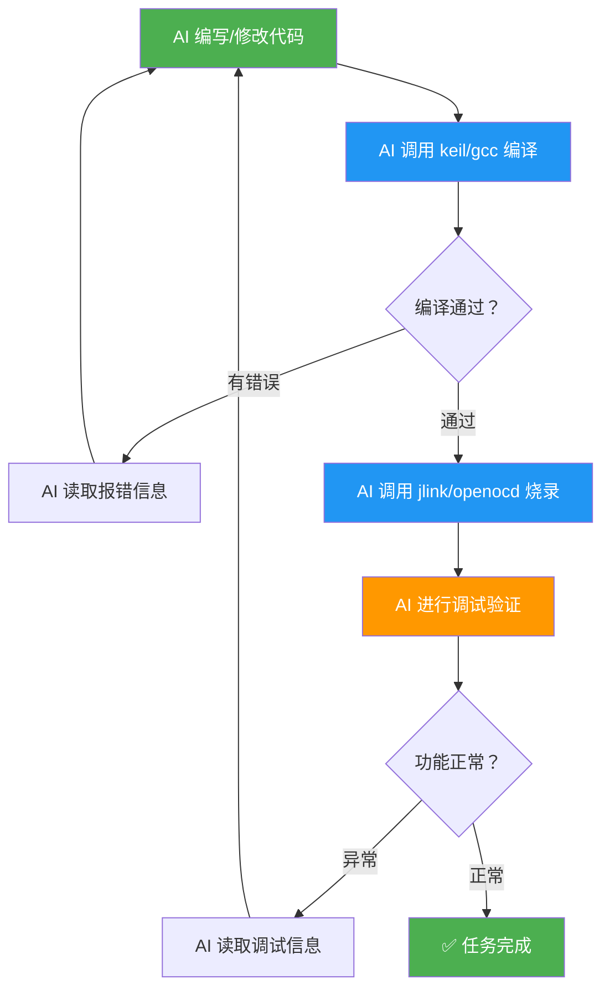
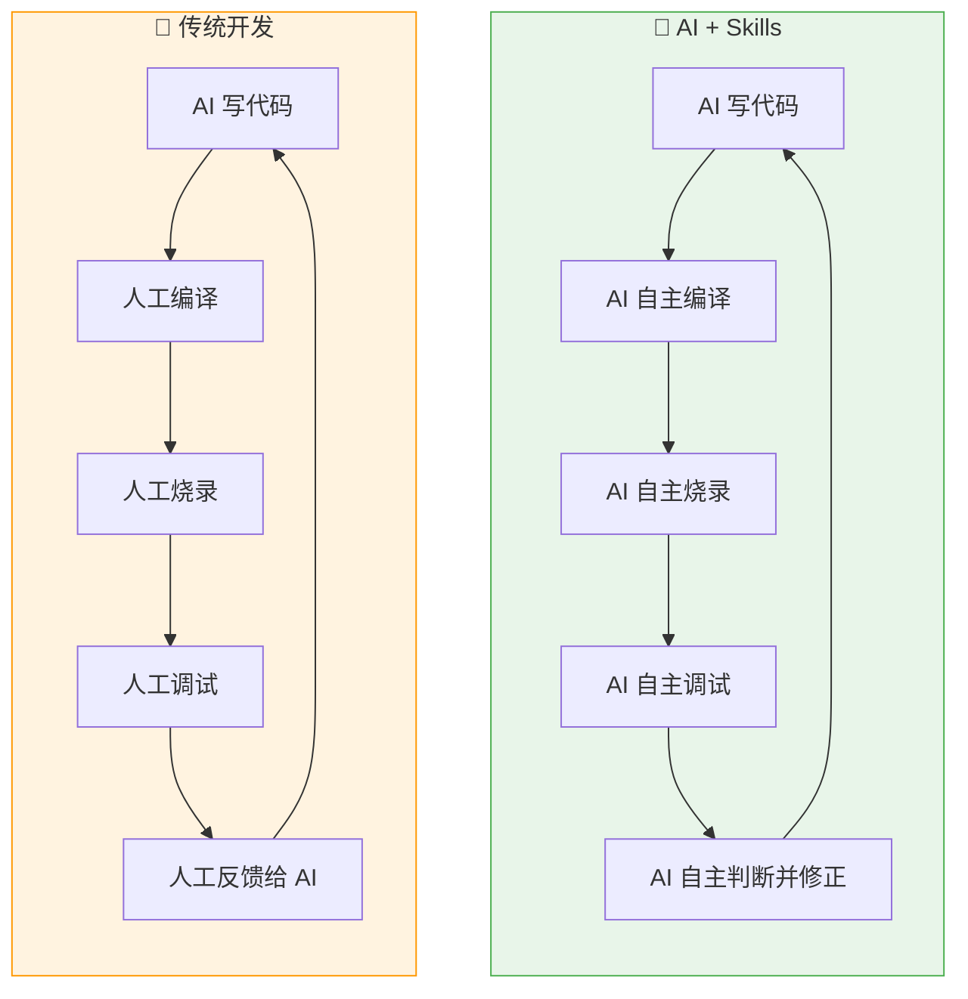
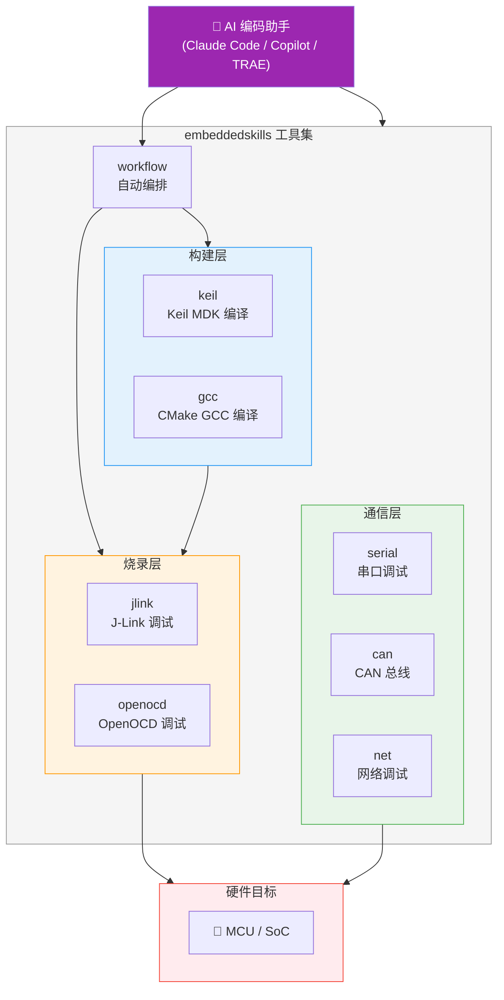

简体中文 | [English](./README.en.md)

# embeddedskills — 嵌入式开发调试工具集

**让 AI 不止写代码，还能编译、烧录、调试——补上嵌入式开发自动化的最后一环。**

一套开源的嵌入式开发调试 Skill 集合，适用于 Claude Code、Copilot、TRAE 及其他支持 Skill 协议的 AI 编码助手。安装后，AI 助手即可直接操控编译器、调试器和通信总线，实现从代码编写到硬件验证的全流程自动化。

## 为什么需要这套工具？

### 现状：AI 只能帮你写一半

当前的 AI 编码助手（Claude、Copilot、TRAE 等）已经能很好地辅助方案设计和代码编写。但嵌入式开发不同于纯软件——写完代码只是开始，**编译、烧录、调试**这些与硬件打交道的步骤仍然需要开发者手动完成。

```
传统流程中 AI 只能覆盖前半段：

  AI 能做的          ┃  仍需人工的
  ━━━━━━━━━━━━━━━━━━━╋━━━━━━━━━━━━━━━━━━━
  方案设计            ┃  编译构建
  代码编写            ┃  烧录下载
  代码审查            ┃  断点调试
                     ┃  串口/CAN/网络调试
                     ┃  问题定位与修复
```

**痛点**：每次 AI 改完代码，你都要手动编译、烧录、观察结果、再把错误信息喂回给 AI——这个循环既低效又打断心流。

### 解决方案：让 AI 自己闭环

这套 Skill 赋予 AI 助手操控硬件工具链的能力，使其能够自主完成完整的开发-调试循环：



**AI 可以自主执行的完整流程：**

1. **编写代码** → 根据需求生成或修改源文件
2. **编译检查** → 调用 Keil / GCC 编译，读取报错，自动修改直至编译通过
3. **烧录程序** → 通过 J-Link / OpenOCD 将固件下载到芯片
4. **断点调试** → 设置断点、单步执行、查看寄存器和内存
5. **通信调试** → 通过串口 / CAN / 网络读取运行数据，判断程序行为
6. **自我修正** → 根据调试结果自动调整代码，重复上述循环直到功能达标

### 传统开发 vs AI 赋能开发



| 对比项 | 传统 AI 辅助 | AI + Skills |
|--------|-------------|-------------|
| 代码编写 | ✅ AI 生成 | ✅ AI 生成 |
| 编译构建 | ❌ 人工操作 | ✅ AI 自主调用 Keil / GCC |
| 烧录下载 | ❌ 人工操作 | ✅ AI 自主调用 J-Link/OpenOCD |
| 调试验证 | ❌ 人工操作 | ✅ AI 自主断点/寄存器/内存 |
| 通信调试 | ❌ 人工操作 | ✅ AI 自主串口/CAN/网络 |
| 错误修正 | ❌ 人工转述给 AI | ✅ AI 自主读取并修正 |
| **开发闭环** | **❌ 人在回路** | **✅ AI 自主闭环** |

## 架构总览



## Skill 一览

## 二维分类

### 按工程类型分类

| 类别 | 识别方式 | 主职责 |
|------|----------|--------|
| **Keil 工程** | 识别 `.uvprojx/.uvmpw` 工程文件（等价于识别 `.keil` 工程） | 工程扫描、Target 枚举、构建 |
| **GCC 工程** | 识别 `CMakeLists.txt` + `CMakePresets.json` / 工具链文件的嵌入式 CMake 工程 | preset 枚举、configure、build、size |

> 当前 `gcc` skill 明确面向 **CMake 型 arm-none-eabi-gcc 工程**，不包含纯 Makefile 工程。

### 按调试工具分类

| 类别 | 主职责 | 输入依赖 |
|------|--------|----------|
| **J-Link** | 烧录、寄存器/内存访问、RTT/SWO、在线调试、GDB 调试 | 固件路径 + 芯片/接口参数 |
| **OpenOCD** | 烧录、擦除、复位、Telnet/GDB 调试、Semihosting/ITM | 固件路径 + board/interface/target 参数 |

这两套分类是正交的。`Keil -> J-Link`、`Keil -> OpenOCD`、`GCC -> J-Link`、`GCC -> OpenOCD` 都允许成立。构建层负责产出固件路径，调试层负责烧录和在线调试。

| Skill | 用途 | 子命令 |
|-------|------|--------|
| **keil** | Keil MDK 工程扫描、Target 枚举、编译、重建、清理，`flash` 作为兼容入口保留 | `scan` `targets` `build` `rebuild` `clean` `flash` |
| **gcc** | CMake 型 GCC 嵌入式工程扫描、preset 枚举、配置、编译、大小分析 | `scan` `presets` `configure` `build` `rebuild` `clean` `size` |
| **jlink** | J-Link 烧录、读写内存、寄存器、RTT/SWO、在线调试、one-shot GDB | `info` `flash` `read-mem` `write-mem` `regs` `reset` `rtt` `swo` `halt` `go` `step` `run-to` `gdb backtrace` `gdb locals` `gdb break` `gdb continue` `gdb next` `gdb step` `gdb finish` `gdb until` `gdb frame` `gdb print` `gdb watch` `gdb disassemble` `gdb threads` `gdb crash-report` |
| **openocd** | OpenOCD 烧录、擦除、底层查询、GDB/Telnet 调试、Semihosting/ITM | `probe` `flash` `erase` `reset` `reset-init` `targets` `flash-banks` `adapter-info` `raw` `gdb server` `gdb backtrace` `gdb locals` `gdb break` `gdb continue` `gdb next` `gdb step` `gdb finish` `gdb until` `gdb frame` `gdb print` `gdb watch` `gdb disassemble` `gdb threads` `gdb crash-report` `semihosting` `itm` |
| **workflow** | 发现工程、选择后端、串联 workspace 状态、聚合结果 | `plan` `build` `build-flash` `build-debug` `observe` `diagnose` |
| **serial** | 串口扫描、实时监控、数据发送、Hex 查看、日志 | `scan` `monitor` `send` `hex` `log` |
| **can** | CAN/CAN-FD 接口扫描、监控、发帧、DBC 解码 | `scan` `monitor` `send` `log` `decode` `stats` |
| **net** | 抓包、pcap 分析、连通性测试、端口扫描 | `iface` `capture` `analyze` `ping` `scan` `stats` |

## 安装

### 方法一：npx 安装（推荐）

```bash
# 安装全部 skill（全局）
npx skills add https://github.com/luhao200/embeddedskills -g -y

# 仅安装某个 skill
npx skills add https://github.com/luhao200/embeddedskills --skill jlink -g -y
```

常用管理命令：

```bash
npx skills ls -g        # 查看已安装的 skill
npx skills update -g    # 更新
npx skills remove -g    # 移除
```

### 方法二：克隆到本地

```bash
# 克隆仓库到 skill 目录（全局生效）
git clone https://github.com/luhao200/embeddedskills ~/.claude/skills/embeddedskills

# 或仅用于当前项目（放在项目根目录下）
git clone https://github.com/luhao200/embeddedskills .claude/skills/embeddedskills
```

### 配置

安装完成后，将需要使用的 skill 的 `config.example.json` 复制为 `config.json`，填入本地实际路径和参数：

```bash
cd ~/.claude/skills/embeddedskills/jlink
cp config.example.json config.json
# 编辑 config.json，填写 JLink.exe 路径、默认芯片型号等
```

> `config.json` 已被 `.gitignore` 排除，不会被提交。

### 依赖

| Skill | 外部依赖 |
|-------|----------|
| keil | Keil MDK (UV4.exe) |
| gcc | CMake, Ninja/Make, ARM GNU Toolchain |
| jlink | SEGGER J-Link Software, arm-none-eabi-gdb |
| openocd | OpenOCD, 调试器驱动 (ST-Link/CMSIS-DAP/DAPLink/FTDI) |
| serial | `pip install pyserial` + USB 转串口驱动 |
| can | `pip install python-can cantools pyserial` + USB-CAN 驱动 |
| net | Wireshark (tshark), Npcap |

## 各 Skill 详细介绍

### keil — Keil MDK 编译构建

扫描 `.uvprojx` / `.uvmpw` 工程文件，枚举 Target，执行增量编译 / 全量重建 / 清理，并解析构建日志提取错误数、警告数、代码尺寸等信息。构建结果会尽量返回 `flash_file` / `debug_file` 等产物路径，便于后续交给 J-Link 或 OpenOCD。`flash` 子命令保留为兼容入口，不作为推荐的主路径。

**实现方式：** Python 脚本调用 UV4.exe 命令行，解析返回码、构建日志和工程输出目录。仅在 build 无错误时允许 flash。

---

### gcc — CMake 型 GCC 嵌入式构建

扫描带 `CMakeLists.txt` 且包含 `CMakePresets.json` 或嵌入式工具链文件的工程，枚举 preset，执行 configure / build / rebuild / clean，并分析 ELF 大小。构建结果返回 `elf_file`，可直接交给 J-Link 或 OpenOCD 做后续调试。

**实现方式：** Python 脚本调用 `cmake --preset` / `cmake --build` / `arm-none-eabi-size`，解析日志、构建目录和 ELF 产物。

---

### jlink — J-Link 探针调试

**基础操作：** 探针检测 (`info`)、固件烧录 (`flash`)、内存读写 (`read-mem` / `write-mem`)、寄存器查看 (`regs`)、目标复位 (`reset`)、RTT 日志 (`rtt`)

**轻量调试：** 暂停 (`halt`) / 恢复 (`go`) / 单步 (`step`) / 断点运行 (`run-to`)

**GDB 源码级调试：** 支持 `backtrace / locals / break / continue / next / step / finish / until / frame / print / watch / disassemble / threads / crash-report`

**观测通道：** RTT (`rtt`) 与可插拔 SWO 包装层 (`swo`)

**实现方式：**
- `jlink_exec.py` — 生成 `.jlink` 命令脚本交由 JLink.exe 执行
- `jlink_rtt.py` — 启动 JLinkGDBServerCL + JLinkRTTClient 读取 RTT 输出
- `jlink_gdb.py` — 启动 GDB Server 后用 arm-none-eabi-gdb 执行统一 one-shot 调试子命令
- `jlink_swo.py` — 对外部 SWO viewer 做统一事件流包装

---

### openocd — OpenOCD 调试烧录

探针探测 (`probe`)、固件烧录 (`flash`)、Flash 擦除 (`erase`)、目标复位 (`reset` / `reset-init`)、底层查询 (`targets` / `flash-banks` / `adapter-info` / `raw`)、统一 GDB 子命令、Semihosting 与 ITM 观测。

**实现方式：** Python 脚本拼接 OpenOCD 命令行参数并执行，支持 board 配置优先于 interface + target 组合。GDB 调试使用统一 one-shot 命令集；观测层新增 `openocd_itm.py` 以复用官方 TPIU/ITM 命令。

**支持的调试器：** ST-Link V2/V3, CMSIS-DAP, DAPLink, J-Link, FTDI

---

### serial — 串口调试

扫描可用串口 (`scan`)、实时文本监控 (`monitor`)、发送文本/Hex 数据 (`send`)、二进制 Hex 查看 (`hex`)、日志记录 (`log`)。

**实现方式：** 基于 pyserial 的 5 个独立脚本，流式命令使用 JSON Lines 格式输出。支持正则过滤、多种日志格式 (text/csv/json)。内置 USB 转串口芯片 VID/PID 映射 (CH340, CP2102, FT232, PL2303 等)。

---

### can — CAN 总线调试

接口扫描 (`scan`)、实时监控 (`monitor`)、帧发送 (`send`)、流量记录 (`log`)、DBC/ARXML/KCD 数据库解码 (`decode`)、总线统计 (`stats`)。

**实现方式：** 基于 python-can + cantools 的 6 个脚本，支持 PCAN、Vector、IXXAT、Kvaser、slcan、socketcan、gs_usb、virtual 多种后端。

---

### net — 网络调试

接口发现 (`iface`)、实时抓包 (`capture`)、离线 pcap 分析 (`analyze`)、连通性测试 (`ping`)、端口扫描 (`scan`)、流量统计 (`stats`)。

**实现方式：** 基于 tshark / capinfos 的 6 个脚本。端口扫描默认覆盖嵌入式常用端口 (Modbus TCP, MQTT, CoAP, OPC UA, S7comm, BACnet, EtherNet/IP 等)。

---

### workflow — 自动编排

发现当前 workspace 中的 Keil / GCC 工程，选择 build/flash/debug/observe 后端，并通过 `.embeddedskills/state.json` 串联最近一次构建、烧录、调试、观测结果。

**实现方式：**
- `workflow_plan.py` — 发现工程、候选后端和最近状态
- `workflow_run.py` — 薄编排入口，调用现有 skill 脚本并聚合结果

---

## 通用架构

### 目录结构

每个 Skill 的目录结构：

```
<skill>/
├── SKILL.md            # Skill 元数据与执行规则（必需）
├── README.md           # 用户文档
├── config.json         # 当前配置（.gitignore 已排除）
├── config.example.json # 配置模板
├── scripts/            # Python 脚本
└── references/         # 参考数据 (JSON/Markdown)
```

### 统一输出格式

```json
{
  "status": "ok|error",
  "action": "...",
  "summary": "简短摘要",
  "details": {},
  "context": {},
  "artifacts": {},
  "metrics": {},
  "state": {},
  "next_actions": [],
  "timing": {}
}
```

兼容层仍保留 `{status, action, summary, details}` 四个基础字段。流式命令使用 JSON Lines，并统一带上 `source / channel_type / stream_type`。

### Workspace 共享状态

运行期状态存放在当前 workspace 的 `.embeddedskills/state.json`，而不是用户全局目录。当前至少会记录：

- `last_build`
- `last_flash`
- `last_debug`
- `last_observe`

### 执行模式

通过 `config.json` 中的 `operation_mode` 控制：

| 模式 | 说明 |
|------|------|
| 1 | 立即执行 |
| 2 | 显示风险摘要，不阻断 |
| 3 | 执行前要求确认 |

### 设计原则

- **不猜测关键参数** — 设备型号、接口、端口等必须明确指定
- **多选项时列出候选** — 不自动选择
- **失败时提供排查建议**
- **纯 Python 标准库实现**（CAN 和串口除外，需 python-can / pyserial）

## 完成进度

| Skill | 状态 |
|-------|------|
| keil | ✅ 已完成测试 |
| gcc | ✅ 已完成测试 |
| jlink | ✅ 已完成测试 |
| workflow | 🔧 待测试 |
| serial | ✅ 已完成测试 |
| net | ✅ 已完成测试 |
| openocd | 🔧 待测试 |
| can | 🔧 待测试 |

## License

MIT
