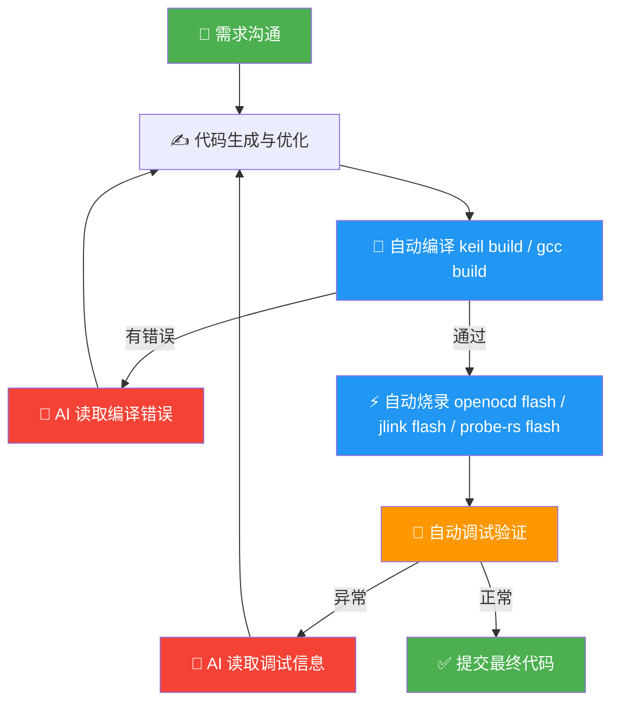

<div align="center">

简体中文 | [English](./README.en.md)

# embeddedskills — 嵌入式 AI 开发调试 Skill 集

**让 AI 编码助手直接操控编译器、调试器和通信总线，实现从代码生成到硬件验证的完整闭环。**

[](LICENSE)
[]()
[](https://github.com/zhinkgit/embeddedskills/stargazers)

[](https://claude.ai/code)
[](https://github.com/openai/codex)
[](https://trae.ai)
[](https://cursor.sh)
[](https://kiro.ai)

</div>

---

## ✨ 三大核心优势

### 🔁 嵌入式 AI 工作流闭环

嵌入式开发有一道纯软件开发没有的鸿沟：写完代码只是开始，编译、烧录、调试每一步都需要人在中间传递信息。

> AI 改完代码 → **你**手动编译 → **你**手动烧录 → **你**把报错复制给 AI → AI 再改 → **你**再编译……

**embeddedskills 把这个循环交给 AI 自己跑：**



| 环节 | 传统 AI 辅助 | AI + embeddedskills |
|------|------------|-------------------|
| 代码编写 | AI 生成 | AI 生成 |
| 编译构建 | **人工操作** | ✅ AI 调用 Keil / GCC |
| 烧录下载 | **人工操作** | ✅ AI 调用 J-Link / OpenOCD |
| 调试验证 | **人工操作** | ✅ AI 断点 / 寄存器 / 内存 |
| 通信调试 | **人工操作** | ✅ AI 串口 / CAN / 网络 |
| 错误修正 | **人工转述给 AI** | ✅ AI 读取并自主修正 |

---

### 🆓 完全免费，不限 AI 工具

本项目完全开源免费（MIT 协议）。只要 AI 工具支持 Skill / CLAUDE.md / Rules 协议，均可直接使用，包括但不限于：

- **Claude Code**
- **OpenAI Codex CLI**
- **TRAE**
- **Cursor、Kiro、Windsurf** 等其他支持 Skill 协议的工具

无需付费订阅任何附加服务，AI 工具自由切换。

---

### ⚡ 使用简单，无需迁移工程

**直接在现有项目上使用，无需改动任何工程文件。** 支持业界主流工程体系和调试器：

| 维度 | 支持范围 |
|------|---------|
| **构建系统** | Keil MDK 工程、CMake 工程 |
| **调试器** | J-Link（SEGGER）、CMSIS-DAP / DAPLink |
| **烧录框架** | OpenOCD、probe-rs 兼容工具链 |
| **通信总线** | 串口（UART）、CAN / CAN-FD、以太网 |

一条命令安装，AI 即可自动识别工程类型并开始工作：

```bash
npx skills add https://github.com/zhinkgit/embeddedskills -g -y
```

---

## Skill 一览

| 分类 | Skill | 能做什么 | 主要子命令 |
|:---:|:---:|---|---|
| 🔨 构建 | **keil** | Keil MDK 工程扫描、Target 枚举、编译、重建、清理 | `scan` `targets` `build` `rebuild` `clean` `flash` |
| 🔨 构建 | **gcc** | CMake 型 GCC 工程配置、编译、大小分析 | `scan` `presets` `configure` `build` `rebuild` `size` |
| 🔬 调试 | **jlink** | 烧录、读写内存/寄存器、RTT/SWO、GDB 调试 | `flash` `read-mem` `write-mem` `regs` `rtt` `swo` + GDB |
| 🔬 调试 | **openocd** | 烧录、擦除、GDB/Telnet、Semihosting/ITM | `flash` `erase` `reset` `gdb-server` `semihosting` `itm` |
| 🔬 调试 | **probe-rs** | 探针发现、烧录、复位、内存读写、GDB 调试、RTT | `list` `info` `flash` `erase` `reset` `read-mem` `write-mem` `gdb` `rtt` |
| 🔌 通信 | **serial** | 扫描串口、实时监控、发送数据、Hex 查看 | `scan` `monitor` `send` `hex` `log` |
| 🔌 通信 | **can** | CAN/CAN-FD 监控、发帧、DBC 解码、统计 | `scan` `monitor` `send` `decode` `stats` |
| 🔌 通信 | **net** | 抓包分析、连通性测试、端口扫描、流量统计 | `capture` `analyze` `ping` `scan` `stats` |
| 🎯 编排 | **workflow** | 自动识别工程 → 选择工具链 → 串联全流程 | `plan` `build` `build-flash` `build-debug` `observe` `diagnose` |

> [!TIP]
> `Keil / GCC` 与 `J-Link / OpenOCD / probe-rs` 可自由正交组合，六种搭配均可开箱即用。

---

## 安装

### 方法一：npx（推荐）

```bash
# 一键安装全部 skill
npx skills add https://github.com/zhinkgit/embeddedskills -g -y

# 只安装需要的 skill
npx skills add https://github.com/zhinkgit/embeddedskills --skill jlink -g -y

# 管理
npx skills ls -g        # 查看已安装
npx skills update -g    # 更新
npx skills remove -g    # 移除
```

### 方法二：直接 clone

```bash
# Claude Code（全局）
git clone https://github.com/zhinkgit/embeddedskills ~/.claude/skills/embeddedskills

# 仅当前项目
git clone https://github.com/zhinkgit/embeddedskills .claude/skills/embeddedskills
```

> [!NOTE]
> **[→ 完整安装与使用手册](docs/getting-started.md)**，包含截图演示和配置说明。

---

## 工作原理

三个关键设计让 AI 能真正自主闭环：

<details>
<summary><b>① 封装命令行工具</b></summary>

每个 Skill 是一组 Python 脚本，将底层工具（UV4.exe、cmake、JLink.exe、openocd、probe-rs、tshark 等）的命令行参数和交互流程转化为结构化子命令，AI 可以像调用函数一样调用这些工具。

</details>

<details>
<summary><b>② 通过 SKILL.md 暴露给 AI</b></summary>

每个 Skill 目录下的 `SKILL.md` 以自然语言描述能力、子命令和使用场景。AI 读取后即可正确调用，**无需额外训练或配置**，任何支持 Skill 协议的 AI 工具开箱即用。

</details>

<details>
<summary><b>③ 统一 JSON 输出，驱动下一步决策</b></summary>

所有脚本返回统一结构的 JSON，AI 直接解析状态、摘要和建议，自主决定下一步操作：

```json
{
  "status": "ok | error",
  "action": "build",
  "summary": "编译成功，0 errors，2 warnings",
  "details": { "warnings": ["unused variable 'x' at main.c:42"] },
  "artifacts": { "hex": ".embeddedskills/build/output.hex" },
  "next_actions": ["flash to device"]
}
```

</details>

<br>

**三层配置**，按需覆盖，优先级从高到低：

```
CLI 参数  ──►  skill/config.json（工具路径、硬件参数）
          ──►  .embeddedskills/config.json（目标芯片、接口、日志目录）
          ──►  .embeddedskills/state.json（最近一次构建/烧录/调试记录）
          ──►  默认值
```

**统一日志目录：**

```
workspace/
└── .embeddedskills/
    ├── build/          ← 编译日志与 hex/bin 产物
    └── logs/
        ├── serial/     ← 串口监控日志
        ├── can/        ← CAN 报文日志
        └── net/        ← 网络抓包文件
```

---

## 外部依赖

<details>
<summary>展开查看各 Skill 所需依赖</summary>

| Skill | 依赖 |
|---|---|
| keil | Keil MDK (UV4.exe) |
| gcc | CMake · Ninja/Make · ARM GNU Toolchain |
| jlink | SEGGER J-Link Software · arm-none-eabi-gdb |
| openocd | OpenOCD · 调试器驱动 (ST-Link / CMSIS-DAP / DAPLink / FTDI) |
| probe-rs | probe-rs CLI · arm-none-eabi-gdb |
| serial | pyserial · USB 转串口驱动 |
| can | python-can · cantools · pyserial · USB-CAN 驱动 |
| net | Wireshark (tshark) · Npcap |

> 除 CAN 和串口外，所有 Skill 均基于 Python 标准库实现，无需额外安装 Python 依赖。

> [!WARNING]
> Windows 下若要让 `probe-rs` 驱动 `J-Link`，通常需要把驱动切到 `WinUSB`，这会影响 SEGGER 官方工具继续使用。若你仍依赖 J-Link 官方工具链，优先继续使用现有 `jlink` skill。

</details>

---

## 完成进度

| Skill | 状态 |
|---|:---:|
| keil | ✅ 已完成测试 |
| gcc | ✅ 已完成测试 |
| platformio | 🔧 待支持 |
| jlink | ✅ 已完成测试 |
| openocd | ✅ 已完成测试 |
| probe-rs | ✅ 已完成测试 |
| pyocd | 🔧 待支持 |
| serial | ✅ 已完成测试 |
| net | ✅ 已完成测试 |
| can | 🔧 待测试 |
| workflow | ✅ 已完成测试 |

---

## Star History

<a href="https://www.star-history.com/?repos=zhinkgit%2Fembeddedskills&type=date&legend=top-left">
 <picture>
   <source media="(prefers-color-scheme: dark)" srcset="https://api.star-history.com/image?repos=zhinkgit/embeddedskills&type=date&theme=dark&legend=top-left" />
   <source media="(prefers-color-scheme: light)" srcset="https://api.star-history.com/image?repos=zhinkgit/embeddedskills&type=date&legend=top-left" />
   
 </picture>
</a>

欢迎提 Issue 和 PR。感谢 [Linux.do](https://linux.do/) 社区支持。
