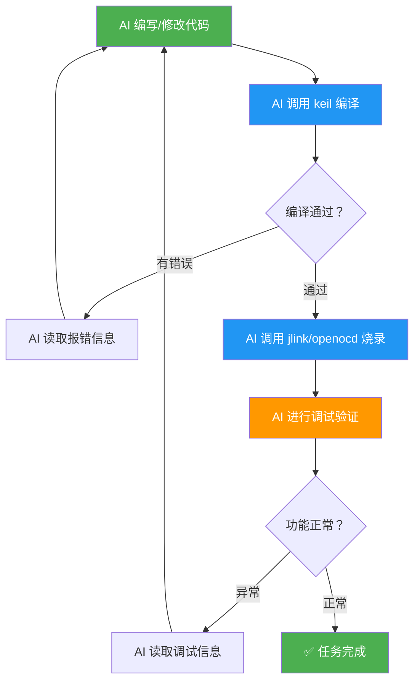
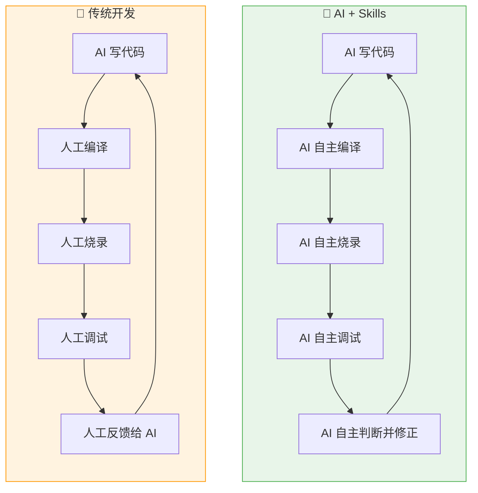
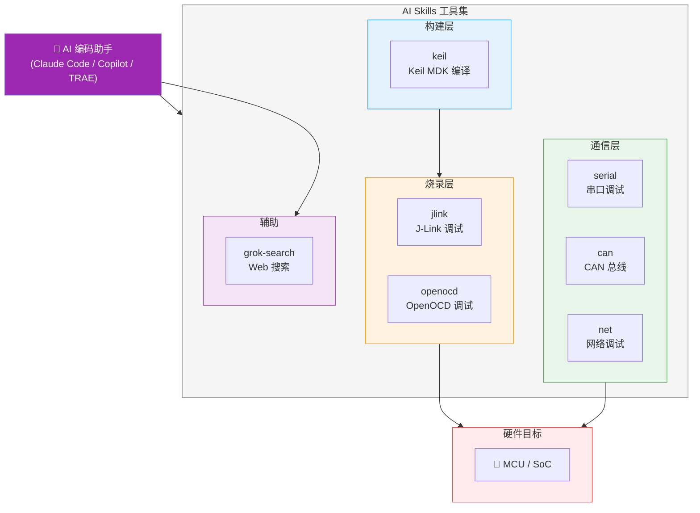

简体中文 | [English](./README.en.md)

# AI Skills — 嵌入式开发调试工具集

**让 AI 不止写代码，还能编译、烧录、调试——补上嵌入式开发自动化的最后一环。**

一套开源的嵌入式开发调试 Skill 集合，适用于 Claude Code、Copilot、TRAE 及其他支持 Skill 协议的 AI 编码助手。安装后，AI 助手即可直接操控编译器、调试器和通信总线，实现从代码编写到硬件验证的全流程自动化。

## 为什么需要这套工具？

### 现状：AI 只能帮你写一半

当前的 AI 编码助手（Claude、Copilot、TRAE 等）已经能很好地辅助方案设计和代码编写。但嵌入式开发不同于纯软件——写完代码只是开始，**编译、烧录、调试**这些与硬件打交道的步骤仍然需要开发者手动完成。

```
传统流程中 AI 只能覆盖前半段：

  AI 能做的          ┃  仍需人工的
  ━━━━━━━━━━━━━━━━━━━╋━━━━━━━━━━━━━━━━━━━
  方案设计            ┃  编译构建
  代码编写            ┃  烧录下载
  代码审查            ┃  断点调试
                     ┃  串口/CAN/网络调试
                     ┃  问题定位与修复
```

**痛点**：每次 AI 改完代码，你都要手动编译、烧录、观察结果、再把错误信息喂回给 AI——这个循环既低效又打断心流。

### 解决方案：让 AI 自己闭环

这套 Skill 赋予 AI 助手操控硬件工具链的能力，使其能够自主完成完整的开发-调试循环：



**AI 可以自主执行的完整流程：**

1. **编写代码** → 根据需求生成或修改源文件
2. **编译检查** → 调用 Keil 编译，读取报错，自动修改直至编译通过
3. **烧录程序** → 通过 J-Link / OpenOCD 将固件下载到芯片
4. **断点调试** → 设置断点、单步执行、查看寄存器和内存
5. **通信调试** → 通过串口 / CAN / 网络读取运行数据，判断程序行为
6. **自我修正** → 根据调试结果自动调整代码，重复上述循环直到功能达标

### 传统开发 vs AI 赋能开发



| 对比项 | 传统 AI 辅助 | AI + Skills |
|--------|-------------|-------------|
| 代码编写 | ✅ AI 生成 | ✅ AI 生成 |
| 编译构建 | ❌ 人工操作 | ✅ AI 自主调用 Keil |
| 烧录下载 | ❌ 人工操作 | ✅ AI 自主调用 J-Link/OpenOCD |
| 调试验证 | ❌ 人工操作 | ✅ AI 自主断点/寄存器/内存 |
| 通信调试 | ❌ 人工操作 | ✅ AI 自主串口/CAN/网络 |
| 错误修正 | ❌ 人工转述给 AI | ✅ AI 自主读取并修正 |
| **开发闭环** | **❌ 人在回路** | **✅ AI 自主闭环** |

## 架构总览



## Skill 一览

| Skill | 用途 | 子命令 |
|-------|------|--------|
| **keil** | Keil MDK 工程编译、重建、清理、烧录 | `scan` `targets` `build` `rebuild` `clean` `flash` |
| **jlink** | J-Link 烧录、读写内存、寄存器、RTT、在线调试 | `info` `flash` `read-mem` `write-mem` `regs` `reset` `rtt` `halt` `go` `step` `run-to` `gdb run` `gdb backtrace` `gdb locals` |
| **openocd** | OpenOCD 烧录、擦除、GDB Server、目标复位 | `probe` `flash` `erase` `gdb-server` `reset` |
| **serial** | 串口扫描、实时监控、数据发送、Hex 查看、日志 | `scan` `monitor` `send` `hex` `log` |
| **can** | CAN/CAN-FD 接口扫描、监控、发帧、DBC 解码 | `scan` `monitor` `send` `log` `decode` `stats` |
| **net** | 抓包、pcap 分析、连通性测试、端口扫描 | `iface` `capture` `analyze` `ping` `scan` `stats` |
| **grok-search** | 通过 Grok API 实时 Web 搜索 | — |

## 安装

### 方法一：npx 安装（推荐）

```bash
# 安装全部 skill（全局）
npx skills add https://github.com/luhao200/aiskills -g -y

# 仅安装某个 skill
npx skills add https://github.com/luhao200/aiskills --skill jlink -g -y
```

常用管理命令：

```bash
npx skills ls -g        # 查看已安装的 skill
npx skills update -g    # 更新
npx skills remove -g    # 移除
```

### 方法二：克隆到本地

```bash
# 克隆仓库到 skill 目录（全局生效）
git clone https://github.com/luhao200/aiskills ~/.claude/skills/aiskills

# 或仅用于当前项目（放在项目根目录下）
git clone https://github.com/luhao200/aiskills .claude/skills/aiskills
```

### 配置

安装完成后，将需要使用的 skill 的 `config.example.json` 复制为 `config.json`，填入本地实际路径和参数：

```bash
cd ~/.claude/skills/aiskills/jlink
cp config.example.json config.json
# 编辑 config.json，填写 JLink.exe 路径、默认芯片型号等
```

> `config.json` 已被 `.gitignore` 排除，不会被提交。

### 依赖

| Skill | 外部依赖 |
|-------|----------|
| keil | Keil MDK (UV4.exe) |
| jlink | SEGGER J-Link Software, arm-none-eabi-gdb |
| openocd | OpenOCD, 调试器驱动 (ST-Link/CMSIS-DAP/DAPLink/FTDI) |
| serial | `pip install pyserial` + USB 转串口驱动 |
| can | `pip install python-can cantools pyserial` + USB-CAN 驱动 |
| net | Wireshark (tshark), Npcap |
| grok-search | Grok API 密钥 |

## 各 Skill 详细介绍

### keil — Keil MDK 编译构建

扫描 `.uvprojx` / `.uvmpw` 工程文件，枚举 Target，执行增量编译 / 全量重建 / 清理 / 烧录，并解析构建日志提取错误数、警告数、代码尺寸等信息。

**实现方式：** Python 脚本调用 UV4.exe 命令行，解析返回码和构建日志。仅在 build 无错误时允许 flash。

---

### jlink — J-Link 探针调试

**基础操作：** 探针检测 (`info`)、固件烧录 (`flash`)、内存读写 (`read-mem` / `write-mem`)、寄存器查看 (`regs`)、目标复位 (`reset`)、RTT 日志 (`rtt`)

**轻量调试：** 暂停 (`halt`) / 恢复 (`go`) / 单步 (`step`) / 断点运行 (`run-to`)

**GDB 源码级调试：** 任意 GDB 命令 (`gdb run`)、调用栈 (`gdb backtrace`)、局部变量 (`gdb locals`)

**实现方式：**
- `jlink_exec.py` — 生成 `.jlink` 命令脚本交由 JLink.exe 执行
- `jlink_rtt.py` — 启动 JLinkGDBServerCL + JLinkRTTClient 读取 RTT 输出
- `jlink_gdb.py` — 启动 GDB Server 后用 arm-none-eabi-gdb 执行命令序列

---

### openocd — OpenOCD 调试烧录

探针探测 (`probe`)、固件烧录 (`flash`)、Flash 擦除 (`erase`)、GDB Server 启动 (`gdb-server`)、目标复位 (`reset`)。

**实现方式：** Python 脚本拼接 OpenOCD 命令行参数并执行，支持 board 配置优先于 interface + target 组合。GDB Server 模式保持进程运行并返回端口信息。

**支持的调试器：** ST-Link V2/V3, CMSIS-DAP, DAPLink, J-Link, FTDI

---

### serial — 串口调试

扫描可用串口 (`scan`)、实时文本监控 (`monitor`)、发送文本/Hex 数据 (`send`)、二进制 Hex 查看 (`hex`)、日志记录 (`log`)。

**实现方式：** 基于 pyserial 的 5 个独立脚本，流式命令使用 JSON Lines 格式输出。支持正则过滤、多种日志格式 (text/csv/json)。内置 USB 转串口芯片 VID/PID 映射 (CH340, CP2102, FT232, PL2303 等)。

---

### can — CAN 总线调试

接口扫描 (`scan`)、实时监控 (`monitor`)、帧发送 (`send`)、流量记录 (`log`)、DBC/ARXML/KCD 数据库解码 (`decode`)、总线统计 (`stats`)。

**实现方式：** 基于 python-can + cantools 的 6 个脚本，支持 PCAN、Vector、IXXAT、Kvaser、slcan、socketcan、gs_usb、virtual 多种后端。

---

### net — 网络调试

接口发现 (`iface`)、实时抓包 (`capture`)、离线 pcap 分析 (`analyze`)、连通性测试 (`ping`)、端口扫描 (`scan`)、流量统计 (`stats`)。

**实现方式：** 基于 tshark / capinfos 的 6 个脚本。端口扫描默认覆盖嵌入式常用端口 (Modbus TCP, MQTT, CoAP, OPC UA, S7comm, BACnet, EtherNet/IP 等)。

---

### grok-search — Web 搜索

通过 Grok API 执行实时 Web 搜索，返回带来源 URL 的结构化 JSON 结果。

**实现方式：** 单脚本调用 Grok API (支持 chat / responses 两种端点)，自动根据模型名选择 API 类型。纯标准库实现，无第三方依赖。

---

## 通用架构

### 目录结构

每个 Skill 的目录结构：

```
<skill>/
├── SKILL.md            # Skill 元数据与执行规则（必需）
├── README.md           # 用户文档
├── config.json         # 当前配置（.gitignore 已排除）
├── config.example.json # 配置模板
├── scripts/            # Python 脚本
└── references/         # 参考数据 (JSON/Markdown)
```

### 统一输出格式

```json
{ "status": "ok|error", "action": "...", "summary": "...", "details": {...} }
```

流式命令使用 JSON Lines，摘要信息输出到 stderr。

### 执行模式

通过 `config.json` 中的 `operation_mode` 控制：

| 模式 | 说明 |
|------|------|
| 1 | 立即执行 |
| 2 | 显示风险摘要，不阻断 |
| 3 | 执行前要求确认 |

### 设计原则

- **不猜测关键参数** — 设备型号、接口、端口等必须明确指定
- **多选项时列出候选** — 不自动选择
- **失败时提供排查建议**
- **纯 Python 标准库实现**（CAN 和串口除外，需 python-can / pyserial）

## 完成进度

| Skill | 状态 |
|-------|------|
| keil | ✅ 已完成测试 |
| jlink | ✅ 已完成测试 |
| serial | ✅ 已完成测试 |
| net | ✅ 已完成测试 |
| grok-search | ✅ 已完成测试 |
| openocd | 🔧 待测试 |
| can | 🔧 待测试 |

## License

MIT
