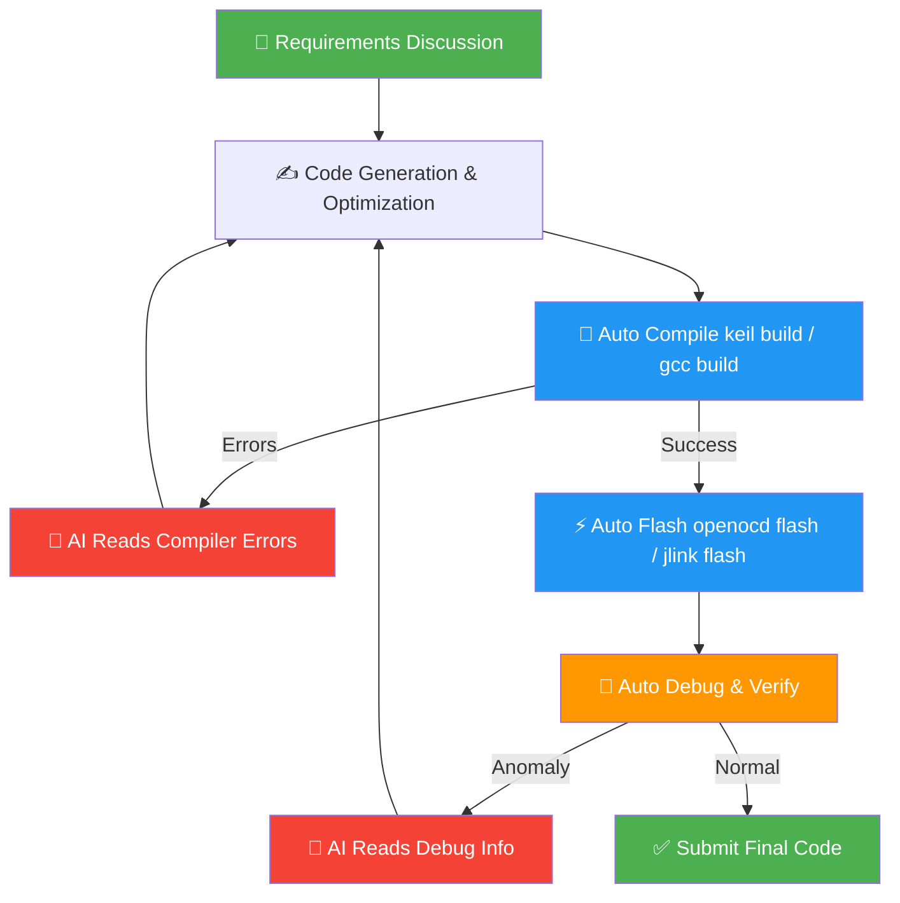

# embeddedskills Quick Start Guide

> This guide uses **Keil MDK + DAP Debugger (OpenOCD) + Codex** as an example to demonstrate the complete workflow from installation to closed-loop development.

---

## Table of Contents

- [embeddedskills Quick Start Guide](#embeddedskills-quick-start-guide)
  - [Table of Contents](#table-of-contents)
  - [1. Installation](#1-installation)
    - [Method 1: npx (Recommended)](#method-1-npx-recommended)
    - [Method 2: Manual Clone](#method-2-manual-clone)
  - [2. Verify Installation](#2-verify-installation)
  - [3. Configure Environment Parameters](#3-configure-environment-parameters)
  - [4. Hardware Connection \& Toolchain Verification](#4-hardware-connection--toolchain-verification)
  - [5. Let AI Take Over](#5-let-ai-take-over)
  - [6. Complete Closed-Loop Workflow](#6-complete-closed-loop-workflow)

---

## 1. Installation

### Method 1: npx (Recommended)

Using the [skills](https://skills.sh/) CLI tool, installation is completed with a single command:

```bash
# Install all skills (auto-detects AI tool and installs)
npx skills add https://github.com/zhinkgit/embeddedskills -g -y
```


```bash
# Install only specific skill (e.g., only openocd)
npx skills add https://github.com/zhinkgit/embeddedskills --skill openocd -g -y

# Management
npx skills ls -g        # List installed
npx skills update -g    # Update to latest version
npx skills remove -g    # Remove
```

---

### Method 2: Manual Clone

If `npx skills` is unavailable, clone directly to the appropriate directory:

```bash
# Claude Code (global)
git clone https://github.com/zhinkgit/embeddedskills.git ~/.claude/skills/embeddedskills

# Codex (global)
git clone https://github.com/zhinkgit/embeddedskills.git ~/.codex/skills

# Codex (current project only)
git clone https://github.com/zhinkgit/embeddedskills.git .codex/skills
```


Common Skill directories reference:

| AI Tool | Global Path | Project-level Path |
|---|---|---|
| Claude Code | `~/.claude/skills/` | `.claude/skills/` |
| Codex | `~/.codex/skills/` | `.codex/skills/` |
| Generic | `~/.agents/skills/` | `.agents/skills/` |
| Cursor / OpenCode | Refer to corresponding tool documentation | — |

---

## 2. Verify Installation

After installation, type `/` in the AI assistant. If you see command descriptions for OpenOCD, keil, etc., the installation is successful.


> [!TIP]
> Don't see slash commands? Troubleshoot in this order:
> - Is the Skill directory path correct (note global vs project-level)
> - Is the `SKILL.md` file complete in each Skill subdirectory
> - Does the AI tool support the Skill protocol or custom instruction loading

---

## 3. Configure Environment Parameters

Skills use a three-layer configuration with priority from high to low:

```
CLI args
  └─► skill/config.json              ← Tool paths, local hardware params (UV4.exe, JLink.exe, etc.)
        └─► .embeddedskills/config.json  ← Project defaults (target chip, interface, log dirs)
              └─► .embeddedskills/state.json  ← Runtime state (last build/flash/debug record)
                    └─► Defaults
```

> [!NOTE]
> **No need to manually edit config files**. On first use, simply talk to the AI. The AI will guide you to fill in tool paths, target chips, and other parameters based on context, and automatically write them to the config files.

---

## 4. Hardware Connection & Toolchain Verification

Use a CMSIS-DAP debugger (such as DAPLink) to connect to the development board.

> [!IMPORTANT]
> Before letting AI take over, it's recommended to manually run a compile and flash once to **confirm the toolchain itself works**. This way, if errors occur later, you can be sure the problem is in the code rather than environment configuration.

**Manual compile verification:**


**Manual flash verification:**


---

## 5. Let AI Take Over

The Skill's `description` field defines trigger keywords. The AI automatically recognizes intent and invokes the corresponding Skill. **Just speak naturally, no need to memorize commands:**

| You Say | AI Triggered Skill |
|---|:---:|
| "Help me compile" | `keil` or `gcc` |
| "Flash to the board" | `openocd` or `jlink` |
| "Check serial output" | `serial` |
| "Step through debugging" | `openocd` or `jlink` |
| "Look at registers" | `openocd` or `jlink` |
| "One-click compile, flash, and debug" | `workflow` |

<br>

**AI autonomously completes compile and flash:**


**AI autonomously debugs:**


<br>

Each invocation result is automatically recorded in the `.embeddedskills/` folder under the project directory for subsequent troubleshooting:


---

## 6. Complete Closed-Loop Workflow



When debugging reveals issues, the AI automatically forms a closed loop of **read error → modify code → recompile → reflash → redebug** without human intervention.

<br>

<details>
<summary><b>Typical Example: Serial Baud Rate Debugging Process</b></summary>

1. AI discovers garbled serial output
2. AI reads code and locates baud rate configuration error (`9600` written as `96000`)
3. AI corrects baud rate configuration
4. AI calls `keil build` to recompile
5. AI calls `openocd flash` to reflash
6. AI calls `serial monitor` to verify again
7. Serial output is normal, closed loop complete

</details>

<br>

> From now on, the development mode becomes: **Describe requirements → AI generates code → Auto compile, flash, debug → Iterate until feature complete.**

---

> Questions? Please submit [GitHub Issues](https://github.com/zhinkgit/embeddedskills/issues). PRs welcome.
