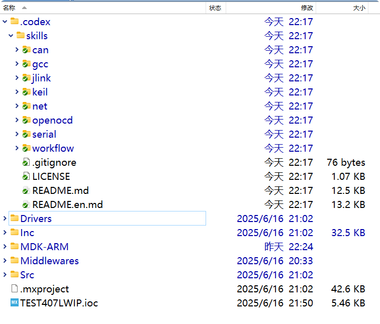
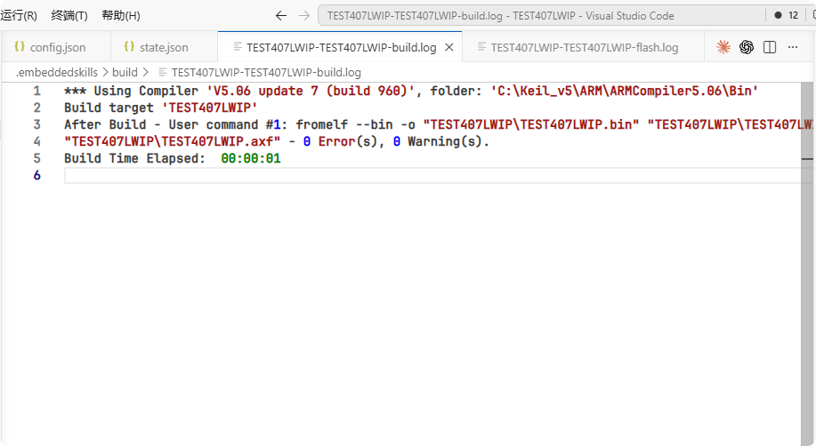
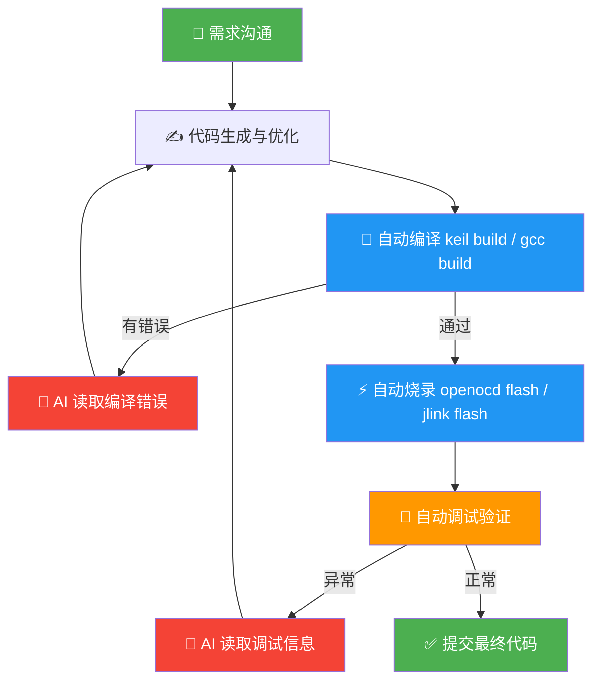

# embeddedskills 快速上手

> 本手册以 **Keil MDK + DAP 调试器（OpenOCD）+ Codex** 为例，演示从安装到闭环开发的完整流程。

---

## 目录

- [embeddedskills 快速上手](#embeddedskills-快速上手)
  - [目录](#目录)
  - [1. 安装](#1-安装)
    - [方式一：npx（推荐）](#方式一npx推荐)
    - [方式二：手动 clone](#方式二手动-clone)
  - [2. 验证安装](#2-验证安装)
  - [3. 配置环境参数](#3-配置环境参数)
  - [4. 硬件连接 \& 工具链验证](#4-硬件连接--工具链验证)
  - [5. 让 AI 接管](#5-让-ai-接管)
  - [6. 完整闭环流程](#6-完整闭环流程)

---

## 1. 安装

### 方式一：npx（推荐）

借助 [skills](https://skills.sh/) CLI 工具，一条命令即可完成安装：

```bash
# 安装全部 skill（自动检测 AI 工具并安装）
npx skills add https://github.com/zhinkgit/embeddedskills -g -y
```


```bash
# 只安装某个 skill（如只需要 openocd）
npx skills add https://github.com/zhinkgit/embeddedskills --skill openocd -g -y

# 管理
npx skills ls -g        # 查看已安装列表
npx skills update -g    # 更新到最新版本
npx skills remove -g    # 移除
```

---

### 方式二：手动 clone

若 `npx skills` 不可用，直接 clone 到对应目录：

```bash
# Claude Code（全局生效）
git clone https://github.com/zhinkgit/embeddedskills.git ~/.claude/skills/embeddedskills

# Codex（全局）
git clone https://github.com/zhinkgit/embeddedskills.git ~/.codex/skills

# Codex（仅当前项目）
git clone https://github.com/zhinkgit/embeddedskills.git .codex/skills
```



常见 Skill 目录参考：

| AI 工具 | 全局路径 | 项目级路径 |
|---|---|---|
| Claude Code | `~/.claude/skills/` | `.claude/skills/` |
| Codex | `~/.codex/skills/` | `.codex/skills/` |
| 通用 | `~/.agents/skills/` | `.agents/skills/` |
| Cursor / OpenCode | 参考对应工具文档 | — |

---

## 2. 验证安装

安装完成后，在 AI 助手中输入 `/`，能看到 OpenOCD、keil 等命令描述即为成功。


> [!TIP]
> 看不到斜杠命令？按以下顺序排查：
> - Skill 目录路径是否正确（注意全局 vs 项目级）
> - `SKILL.md` 文件是否完整存在于每个 Skill 子目录下
> - AI 工具是否支持 Skill 协议或自定义指令加载

---

## 3. 配置环境参数

Skill 采用三层配置，优先级从高到低：

```
CLI 参数
  └─► skill/config.json              ← 工具路径、本机硬件参数（UV4.exe、JLink.exe 等）
        └─► .embeddedskills/config.json  ← 工程默认配置（目标芯片、接口、日志目录）
              └─► .embeddedskills/state.json  ← 运行状态（上次构建/烧录/调试记录）
                    └─► 默认值
```

> [!NOTE]
> **不需要手动编辑配置文件**。首次使用时直接和 AI 对话，AI 会根据上下文引导你填写工具路径、目标芯片等参数，并自动写入配置文件。

---

## 4. 硬件连接 & 工具链验证

使用 CMSIS-DAP 调试器（如 DAPLink）连接开发板。

> [!IMPORTANT]
> 建议在让 AI 接管之前，先手动跑一次编译和烧录，**确认工具链本身没问题**。这样后续如果出错，可以确定问题在代码而不在环境配置。

**手动验证编译：**


**手动验证烧录：**


---

## 5. 让 AI 接管

Skill 的 `description` 字段定义了触发关键词，AI 会自动识别意图并调用对应 Skill。**说人话就够了，不需要记命令：**

| 你说 | AI 触发的 Skill |
|---|:---:|
| "帮我编译一下" | `keil` 或 `gcc` |
| "烧录到板子上" | `openocd` 或 `jlink` |
| "看看串口输出" | `serial` |
| "单步调试一下" | `openocd` 或 `jlink` |
| "看看寄存器" | `openocd` 或 `jlink` |
| "一键编译烧录调试" | `workflow` |

<br>

**AI 自主完成编译下载：**


**AI 自主调试：**


<br>

每次调用结果自动记录到项目目录下的 `.embeddedskills/` 文件夹，方便后续排查问题：




---

## 6. 完整闭环流程



当调试发现问题时，AI 会自动形成 **读取错误 → 修改代码 → 重新编译 → 重新烧录 → 重新调试** 的闭环，无需人工干预。

<br>

<details>
<summary><b>典型例子：串口波特率调试全过程</b></summary>

1. AI 发现串口输出乱码
2. AI 读代码，定位到波特率配置错误（`9600` 写成了 `96000`）
3. AI 修正波特率配置
4. AI 调用 `keil build` 重新编译
5. AI 调用 `openocd flash` 重新烧录
6. AI 调用 `serial monitor` 再次验证
7. 串口输出正常，闭环完成

</details>

<br>

> 此后的开发模式变为：**描述需求 → AI 生成代码 → 自动编译烧录调试 → 迭代修改，直到功能完成。**

---

> 有问题请提 [GitHub Issues](https://github.com/zhinkgit/embeddedskills/issues)，欢迎贡献 PR。
