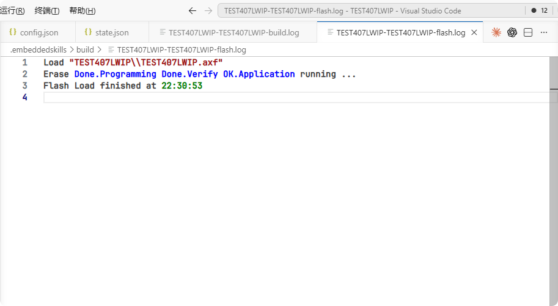
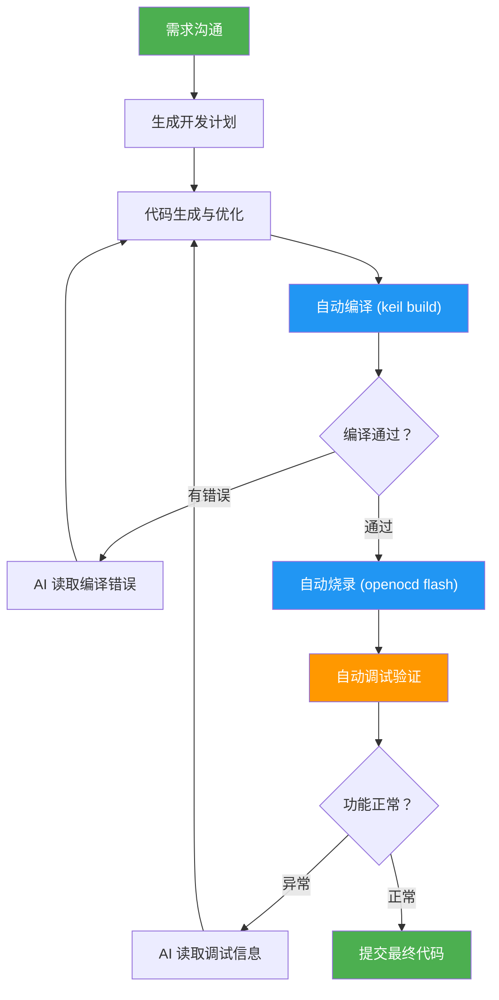
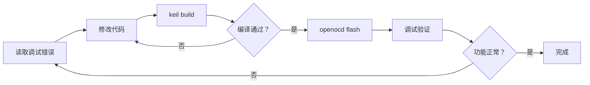

# embeddedskills 使用手册

本手册以 **Keil MDK 工程 + DAP 调试器（OpenOCD）+ Codex** 为示例场景，详细讲解从安装到闭环开发的完整流程。

---

## 1. 安装 Skill

### 1.1 方式一：npx skills 命令安装（推荐）

借助 [skills](https://skills.sh/) CLI 工具，一条命令即可将 Skill 安装到 AI 工具的技能目录中：

```bash
# 安装全部 embeddedskills（全局生效，skills会去寻找你的AI工具自动安装上）
npx skills add https://github.com/zhinkgit/embeddedskills -g -y
```


```bash
# 仅安装某个 skill（如只需要 openocd）
npx skills add https://github.com/zhinkgit/embeddedskills --skill openocd -g -y
```

管理已安装的 Skill：

```bash
npx skills ls -g        # 查看已安装的 skill 列表
npx skills update -g    # 更新到最新版本
npx skills remove -g    # 移除
```


### 1.2 方式二：手动复制到 AI 工具技能文件夹

如果 `npx skills` 不可用，可以手动将仓库克隆到 AI 工具的技能目录中：

**Codex：**

```bash
# 全局生效
git clone https://github.com/zhinkgit/embeddedskills.git ~/.codex/skills

# 仅当前项目生效
git clone https://github.com/zhinkgit/embeddedskills.git .codex/skills
```


**Cursor / OpenCode / 其他支持 Skill 协议的 AI 工具：**

请参考对应工具的文档，将 Skill 目录放置到其技能加载路径下。不同工具的技能目录可能不同，常见路径包括：

| AI 工具 | 技能目录 |
|---------|----------|
| 一些AI | `~/.agents/skills/`（全局） |
| Claude Code | `~/.claude/skills/`  |
| Cursor | 项目根目录下自定义 |
| OpenCode | 参考其 Skill 协议文档 |
| TRAE | 参考其 Skill 协议文档 |

---

## 2. 验证安装

安装完成后，在 AI 编程助手中输入斜杠命令来验证 Skill 是否被正确识别：

**验证步骤：**

1. 在聊天框中输入 `/`
2. 如果安装正确，AI 应识别出 OpenOCD、keil 等 Skill 的能力描述


如果 AI 没有识别到斜杠命令，请检查：
- Skill 目录是否在正确的技能文件夹路径下
- SKILL.md 文件是否完整存在
- AI 工具是否支持 Skill 协议或自定义指令

---

## 3. 配置环境参数

Skill 采用三层配置结构，优先级从高到低为：**CLI 参数 > 环境级配置 > 工程级配置 > 运行状态 > 默认值**。

直接和AI对话就行了，AI会自动引导你完成配置，主要是一些环境变量和路径的设置。

---

## 4. 硬件连接与功能测试

### 4.1 硬件连接

使用 CMSIS-DAP 调试器（如 DAPLink）连接开发板。

### 4.2 手动验证编译下载功能

在让 AI 自主调用 Skill 之前，建议先手动验证工具链是否工作正常。


---

## 5. AI 编程助手集成

### 5.1 自然语言触发

Skill 的 `description` 字段定义了触发关键词。AI 会自动识别上下文并调用对应 Skill，无需手动输入斜杠命令：

| 你的话 | AI 自动触发的 Skill |
|--------|---------------------|
| "帮我编译一下" | `keil` 或 `gcc` |
| "烧录到板子上" | `openocd` 或 `jlink` |
| "看看串口输出" | `serial` |
| "单步调试一下" | `openocd` 或 `jlink` |
| "看看寄存器" | `openocd` 或 `jlink` |
| "一键编译烧录调试" | `workflow` |

一句话，AI 就能理解你的意图，自动调用对应的 Skill 完成编译、烧录、调试等操作。

项目第一次使用时，AI 会引导你完成环境配置和工具链验证，后续就可以直接用自然语言触发自动化流程了。

AI自己编译下载：


AI自己调试：


按照Skill的设计，AI调用Skill完成编译调试工作后，会在项目目录下生成一个 `embeddedskills.log` 文件，记录每次调用的结果和相关信息，方便后续查看和排查问题。




以后你可以这样开发：帮我实现XXX功能，生成代码以后下载到芯片里调试并修改代码，直到完成所有功能

---

## 6. 完整开发工作流

下面是一个基于 **Keil + DAP(OpenOCD) + Codex** 的完整自动化闭环流程：



### 6.1 错误修复闭环

当调试发现问题时，AI 会自动形成 **读取错误 → 修改代码 → 重新编译 → 重新烧录 → 重新调试** 的闭环：



**典型闭环示例：**

1. AI 发现串口输出乱码
2. AI 读取代码，发现波特率配置错误
3. AI 修改代码中的波特率配置
4. AI 调用 `/keil build` 重新编译
5. AI 调用 `/openocd flash` 重新烧录
6. AI 调用 `/serial monitor` 再次验证
7. 串口输出正常，闭环完成

---

> 本手册持续更新中，如有问题请提交 [GitHub Issues](https://github.com/zhinkgit/embeddedskills/issues)。