# embeddedskills 快速上手

> **Keil MDK + DAP 调试器（OpenOCD）+ Codex** 完整演示。

---

## 1. 安装

### 方式一：npx（推荐）

```bash
# 安装全部 skill
npx skills add https://github.com/zhinkgit/embeddedskills -g -y

# 只安装某个 skill
npx skills add https://github.com/zhinkgit/embeddedskills --skill openocd -g -y
```

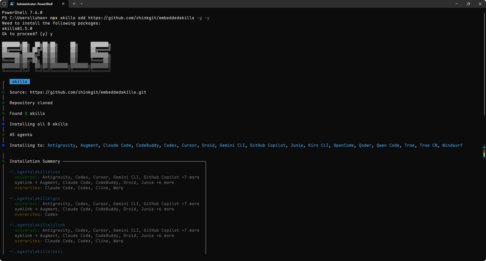

```bash
npx skills ls -g        # 查看已安装列表
npx skills update -g    # 更新到最新版本
npx skills remove -g    # 移除
```

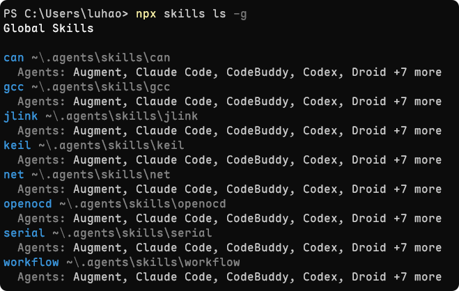

### 方式二：手动 clone

```bash
# Claude Code
git clone https://github.com/zhinkgit/embeddedskills.git ~/.claude/skills/embeddedskills

# Codex（全局）
git clone https://github.com/zhinkgit/embeddedskills.git ~/.codex/skills

# Codex（仅当前项目）
git clone https://github.com/zhinkgit/embeddedskills.git .codex/skills
```

常见 Skill 目录参考：

| AI 工具 | 路径 |
|---|---|
| Claude Code | `~/.claude/skills/` |
| Codex | `~/.codex/skills/` |
| 通用 | `~/.agents/skills/` |

---

## 2. 验证安装

在 AI 助手中输入 `/`，能看到 OpenOCD、keil 等命令即为成功。

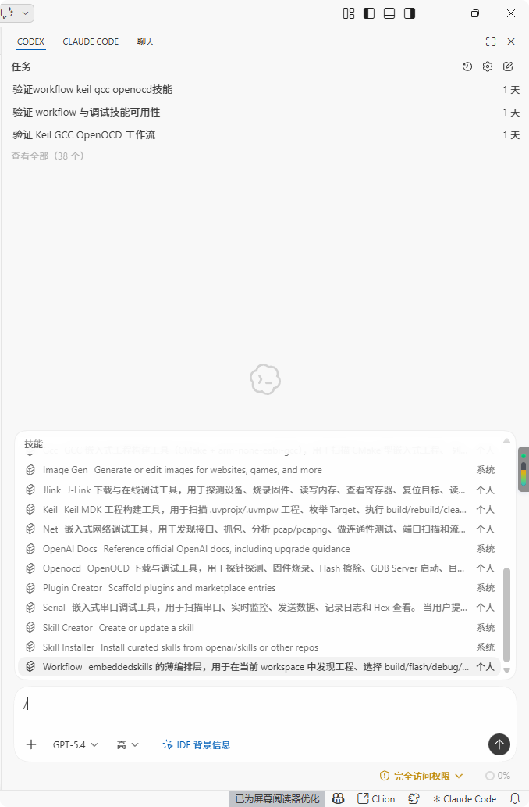

看不到？检查：
- Skill 目录路径是否正确
- `SKILL.md` 文件是否完整
- AI 工具是否支持 Skill 协议

---

## 3. 配置

Skill 采用三层配置，优先级：**CLI 参数 > 环境级 > 工程级 > 默认值**。

**不需要手动编辑配置文件**。首次使用时直接跟 AI 对话，AI 会引导你完成所有配置。

---

## 4. 硬件连接 & 工具链验证

用 CMSIS-DAP 调试器（如 DAPLink）连接开发板，建议在让 AI 接管之前先手动跑一次编译和烧录，确认工具链本身没问题。

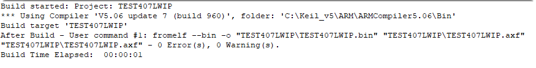
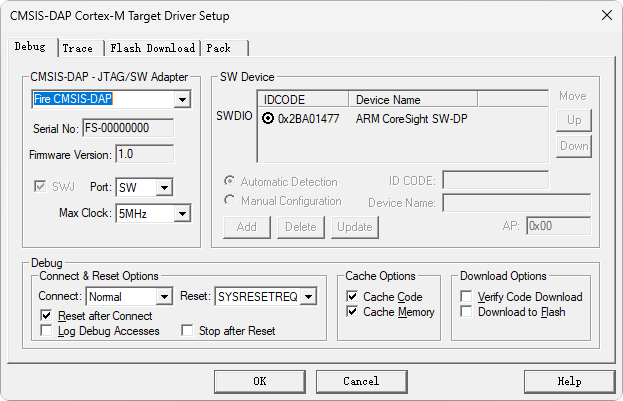
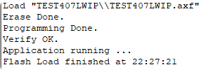

---

## 5. 让 AI 接管

说人话就够了，不需要记命令：

| 你说 | AI 触发 |
|---|---|
| "帮我编译一下" | `keil` 或 `gcc` |
| "烧录到板子上" | `openocd` 或 `jlink` |
| "看串口输出" | `serial` |
| "单步调试" | `openocd` 或 `jlink` |
| "看寄存器" | `openocd` 或 `jlink` |
| "一键编译烧录调试" | `workflow` |

**AI 自主完成编译下载：**

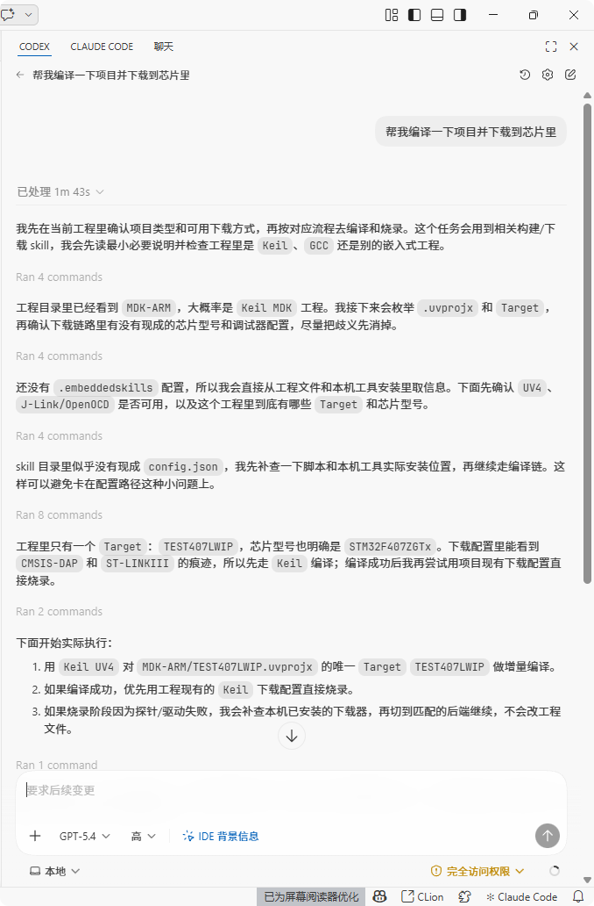
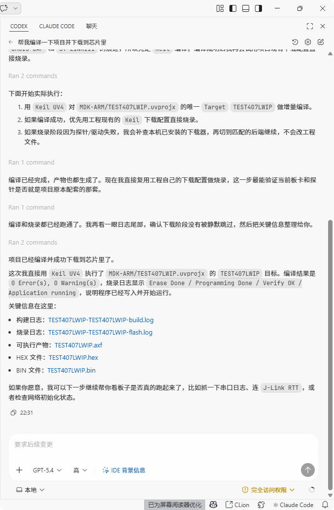

**AI 自主调试：**

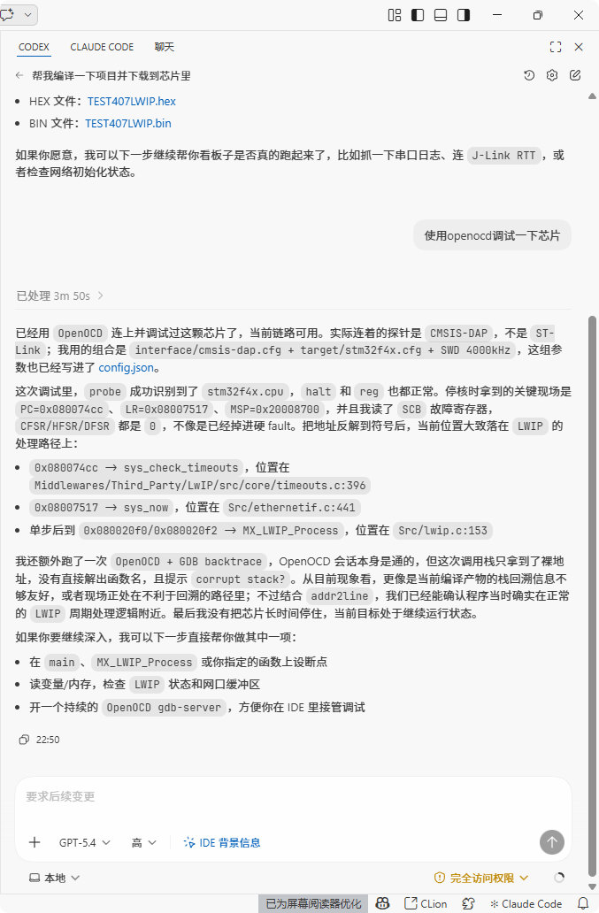

每次调用结果自动记录到项目目录下的 `.embeddedskills/` 文件夹，方便排查问题：

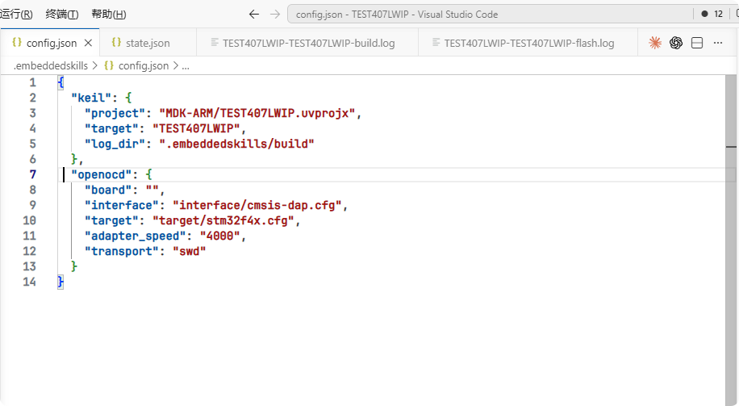
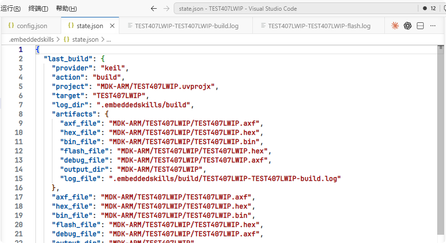

---

## 6. 完整闭环流程

```
需求沟通 → 代码生成 → 自动编译 → 自动烧录 → 自动调试验证
              ↑____________有问题，AI 自动读取错误并修正___|
```

**一个典型例子：**

1. AI 发现串口输出乱码
2. AI 读代码，定位到波特率配置错误
3. AI 修正波特率
4. AI 调用 `keil build` 重新编译
5. AI 调用 `openocd flash` 重新烧录
6. AI 调用 `serial monitor` 验证
7. 串口正常，闭环完成

---

> 有问题请提 [GitHub Issues](https://github.com/zhinkgit/embeddedskills/issues)
